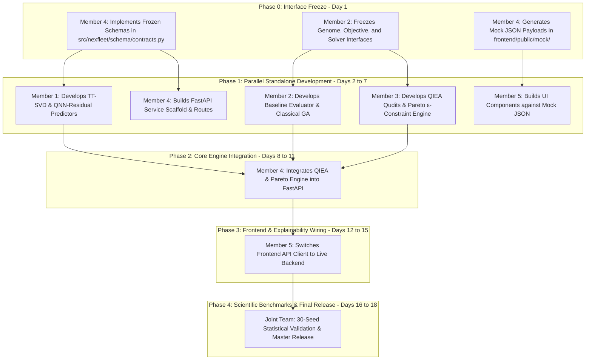

# NEXFLEET 2.0: 5-MEMBER PARALLEL IMPLEMENTATION PLAN
## Definitive Conflict-Free Modular Engineering, Interface Freeze & SIH Research Execution Blueprint

**Document Status:** Approved Parallel Implementation Contract (Single Source of Truth)  
**Parent Document:** [`NEXFLEET_MASTER_RESEARCH_AND_PRODUCT_PLAN.md`](file:///c:/Users/Akshat/Downloads/Projects/Nexfleet/NEXFLEET_MASTER_RESEARCH_AND_PRODUCT_PLAN.md)  
**SIH Problem Statement Alignment:** SIH26138 (Quantum-Inspired Prediction & Optimization)  
**Contract Version:** `v1.0.0-FROZEN`  

---

# 1. Executive Summary & Team Roles Matrix

To enable 5 developers to work concurrently with zero merge conflicts, zero architectural collisions, and strict SIH compliance, all project responsibilities, files, schemas, and integration milestones are partitioned with mathematical precision.

```
┌─────────────────────────────────────────────────────────────────────────────────────────────────────────────────┐
│                                       5-MEMBER MODULE OWNERSHIP MATRIX                                          │
├──────────┬──────────────────────────────────────┬───────────────────────────────┬───────────────────────────────┤
│ Member   │ Role / Specialization                │ Core Domain Responsibility    │ Exclusive Files Owned         │
├──────────┼──────────────────────────────────────┼───────────────────────────────┼───────────────────────────────┤
│ MEMBER 1 │ Quantum-Inspired Prediction Lead     │ Physics Baseline + TT-SVD +   │ `src/nexfleet/optimization/   │
│          │                                      │ QNN/QI Residual Predictors +  │   fuel_model.py`              │
│          │                                      │ Classical ML Baselines        │ `  fuel_predictors.py`        │
│          │                                      │                               │ `  synthetic_telemetry.py`    │
│          │                                      │                               │ `  tensor_network.py`         │
│          │                                      │                               │ `scripts/benchmark_fuel_...`  │
│          │                                      │                               │ `tests/test_fuel_predictors.py│
├──────────┼──────────────────────────────────────┼───────────────────────────────┼───────────────────────────────┤
│ MEMBER 2 │ Mathematical Modeling & Baseline     │ Baseline (BAU) Evaluator +    │ `src/nexfleet/fleet/baseline.`│
│          │ Classical Optimization Lead          │ Genome Interfaces + Math      │ `src/nexfleet/fleet/model.py` │
│          │                                      │ Constraints + Classical GA/   │ `src/nexfleet/fleet/loader.py`│
│          │                                      │ PSO/MILP Benchmarks           │ `src/nexfleet/optimization/   │
│          │                                      │                               │   genome.py`, `objective.py`  │
│          │                                      │                               │   `constraints.py`, `costs.py`│
│          │                                      │                               │   `solver.py`                 │
│          │                                      │                               │ `tests/test_objective.py`     │
│          │                                      │                               │ `tests/test_solver.py`        │
│          │                                      │                               │ `tests/test_baseline.py`      │
├──────────┼──────────────────────────────────────┼───────────────────────────────┼───────────────────────────────┤
│ MEMBER 3 │ Quantum-Inspired Optimization Lead   │ QIEA Qudits + Rotation Gates +│ `src/nexfleet/optimization/   │
│          │                                      │ Boltzmann Prior + ε-Constraint│   qiea_solver.py`             │
│          │                                      │ Multi-Objective Pareto Core   │ `  sweep.py`, `exposure.py`   │
│          │                                      │                               │ `  mps_exposure.py`           │
│          │                                      │                               │ `scripts/benchmark_optimizers`│
│          │                                      │                               │ `tests/test_qiea_solver.py`   │
│          │                                      │                               │ `tests/test_sweep.py`         │
├──────────┼──────────────────────────────────────┼───────────────────────────────┼───────────────────────────────┤
│ MEMBER 4 │ Backend Gateway & Schema Owner       │ Shared Contracts + FastAPI    │ `src/nexfleet/schema/` (New)  │
│          │ (Technical Integrator)               │ REST API + Pipeline           │ `src/nexfleet/api/` (New)     │
│          │                                      │ Orchestration + Root Config   │ `pyproject.toml`, `.env...`   │
│          │                                      │                               │ `scripts/run_server.py`       │
│          │                                      │                               │ `tests/conftest.py`           │
│          │                                      │                               │ `tests/test_api_integration.py│
├──────────┼──────────────────────────────────────┼───────────────────────────────┼───────────────────────────────┤
│ MEMBER 5 │ Frontend & Explainability Lead       │ Next.js 16 UI + Scenario Form │ `frontend/app/` (All Routes)  │
│          │                                      │ + 3-Way Benchmark Scorecard + │ `frontend/components/` (All)  │
│          │                                      │ Waterfall + CSV/PDF Dispatch  │ `frontend/lib/`, `types/`     │
│          │                                      │                               │ `frontend/public/mock/`       │
└─────────────────────────────────────────────────────────────────────────────────────────────────────────────────┘
```

---

# 2. Repository Infrastructure & Shared File Ownership

To prevent merge conflicts in shared configuration, test runners, and documentation, single-person ownership is established for all non-module files:

| File / Directory | Single Assigned Owner | Permissions for Other Members | Notes |
| :--- | :--- | :--- | :--- |
| `pyproject.toml` | **Member 4** | Read-Only (Submit dependency request via PR) | Root build & dependency manifest. |
| `.env.example`, `.gitignore` | **Member 4** | Read-Only | Environment variables & Git rules. |
| `tests/conftest.py` | **Member 4** | Read-Only (Shared fixtures managed here) | Shared pytest configuration. |
| `src/nexfleet/schema/` | **Member 4** | Read-Only (Sole Schema Owner) | Authoritative Pydantic data contracts. |
| `src/nexfleet/compliance/` | **Member 2** | Read-Only (Maintained as compliance reference) | Regulatory scope-gating logic. |
| `src/nexfleet/regulatory/` | **Member 2** | Read-Only (Maintained as regulatory reference) | Implied price conversion formulas. |
| `outputs/` | **Member 3 (Solvers) / Member 1 (ML)** | Write to subfolders (`outputs/ml/`, `outputs/opt/`) | Benchmark output artifact directory. |
| `frontend/package.json` | **Member 5** | Read-Only for Python leads | Frontend dependency manifest. |
| `README.md`, Master Plans | **Technical Lead / Joint** | Read-Only (Changes require team consensus) | Master project documentation. |

---

# 3. Contract Freeze Protocol (`v1.0.0-FROZEN`)

All data exchange between modules, backend, and frontend must strictly conform to the frozen Pydantic models defined in `src/nexfleet/schema/`.

### 1. Protocol Rules
1. **Schema Authority:** Member 4 is the **sole writer** of `src/nexfleet/schema/contracts.py`.
2. **Backward Compatibility Rule:** No existing field name or type may be renamed or deleted. New fields must be `Optional` with safe defaults.
3. **Change Request Process (RFC):**
   * A member needing a schema change files a request in the team issue tracker with proposed fields and rationale.
   * Approval requires sign-off from **Member 4 (Schema Owner)** and the downstream consumer.
   * Member 4 updates the schema and bumps the version tag (e.g., `v1.1.0`).
4. **Communication:** Any schema update triggers an immediate broadcast notification to all members before merging to `main`.

---

# 4. Frozen Interface Specifications

```
                                      [ FROZEN CORE INTERFACES ]
                                                  │
                 ┌────────────────────────────────┼────────────────────────────────┐
                 ▼                                ▼                                ▼
       [ OperationalContext ]           [ PredictionResult ]            [ OptimizationPlanResult ]
       (Input Fleet & Scenario)         (Multi-Model Fuel Output)       (Multi-Objective Solutions)
                 │                                │                                │
                 ▼                                ▼                                ▼
       [ BaselineResult ]               [ SolverResult ]                [ TripartiteScorecard ]
       (Status-Quo BAU Ledger)          (Raw Algorithm Output)          (BAU vs GA vs QIEA)
```

### A. Operational Context (`OperationalContext`)
```python
from pydantic import BaseModel, Field
from typing import Optional

class VesselSpec(BaseModel):
    vessel_id: str
    band: str  # "A", "B", "C"
    dwt_tonnes: float
    gross_tonnage: float
    engine_type: str  # "conventional_hfo_scrubber", "dual_fuel_lng", "dual_fuel_methanol"
    design_speed_knots: float
    anchor_daily_energy_mj: float
    fixed_opex_usd_per_year: float
    charter_premium_usd_per_sea_day: float
    shore_power_eligible: bool

class RouteSpec(BaseModel):
    route_id: str
    band: str
    distance_nm: float
    min_capacity_dwt_required: float
    is_international: bool = True
    eu_eea_third_country_voyage_fraction: float = 0.0
    eu_eea_berth_fraction: float = 0.0

class FuelSpec(BaseModel):
    fuel_id: str
    price_usd_per_tonne: float
    ghg_intensity_gco2e_per_mj: float
    lcv_mj_per_tonne: float

class BaselineAssignment(BaseModel):
    vessel_id: str
    year: int
    route_id: str
    speed_knots: float
    fuel_id: str
    shore_power: bool = False

class OperationalContext(BaseModel):
    scenario_id: str = "default_scenario"
    horizon_years: list[int] = [2026, 2027, 2028, 2029, 2030]
    vessels: list[VesselSpec]
    routes: list[RouteSpec]
    fuels: list[FuelSpec]
    carbon_target_tco2e: Optional[float] = None
    carbon_price_eua_usd: float = 90.0
    baseline_plan: list[BaselineAssignment]
```

### B. Fuel Prediction Result (`PredictionResult`)
```python
class PredictionResult(BaseModel):
    vessel_id: str
    route_id: str
    speed_knots: float
    fuel_id: str
    year: int
    sea_days: float
    physics_baseline_tonnes: float
    predicted_fuel_tonnes: float
    residual_percentage: float
    annual_energy_mj: float
    lifecycle_ghg_tco2e: float
    confidence_interval: tuple[float, float]
    model_identifier: str  # "physics", "lightgbm", "mlp", "tt_svd", "qnn_residual"
```

### C. Baseline Evaluation Result (`BaselineResult`)
```python
class CostBreakdownItem(BaseModel):
    amount_usd: float
    status: str
    description: str

class BaselineResult(BaseModel):
    total_cost_usd: float
    fuel_cost: CostBreakdownItem
    opex_cost: CostBreakdownItem
    time_charter_cost: CostBreakdownItem
    eu_ets_cost: CostBreakdownItem
    fueleu_penalty_cost: CostBreakdownItem
    nzf_cost: CostBreakdownItem
    total_fuel_tonnes: float
    lifecycle_ghg_tco2e: float
    cii_grades: dict[str, str]  # {"A1/2026": "C", ...}
    is_feasible: bool = True
```

### D. Solver Raw Output (`SolverResult`)
```python
class VesselYearDecision(BaseModel):
    vessel_id: str
    year: int
    route_id: str
    speed_knots: float
    fuel_id: str
    shore_power: bool
    fueleu_pool_opt_in: bool
    fueleu_borrow_election: bool
    fuel_consumed_tonnes: float
    voyage_cost_usd: float
    ghg_emissions_tco2e: float
    cii_letter_rating: str

class SolverResult(BaseModel):
    algorithm_name: str  # "Classical_GA", "QIEA_Qudits", "MILP_Exact"
    best_total_usd: float
    best_lifecycle_ghg_tco2e: float
    decisions: list[VesselYearDecision]
    generations_evaluated: int
    wall_clock_time_seconds: float
    random_seed: int
    convergence_history: list[float]
```

### E. Multi-Objective Optimization Plan (`OptimizationPlanResult`)
```python
class OptimizationPlanResult(BaseModel):
    strategy_id: str  # "lowest_cost", "balanced_pareto", "lowest_emissions", "max_reliability"
    strategy_name: str
    total_cost_usd: float
    net_savings_usd_vs_baseline: float
    savings_percentage: float
    lifecycle_ghg_tco2e: float
    ghg_reduction_percentage: float
    total_bunker_tonnes: float
    cost_ledger: dict[str, float]
    cii_distribution: dict[str, int]  # {"A": 5, "B": 4, "C": 1, "D": 0, "E": 0}
    decisions: list[VesselYearDecision]
    solver_metadata: SolverResult
```

### F. Tripartite Benchmark Scorecard (`TripartiteScorecard`)
```python
class ScorecardRow(BaseModel):
    metric_label: str
    baseline_value: str
    classical_ga_value: str
    qiea_value: str
    pareto_balanced_value: str

class TripartiteScorecard(BaseModel):
    scenario_id: str
    rows: list[ScorecardRow]
```

---

# 5. Detailed Member Work Breakdown & Strict Boundary Matrix

---

## MEMBER 1: Quantum-Inspired Fuel Prediction Lead

### 1. Primary SIH Responsibility
Member 1 owns the **Quantum-Inspired Fuel Consumption Prediction System** and all benchmark predictors. The predictor must not be a black box; it must feature a genuine quantum-inspired parameter/representation architecture combined with hydrodynamic physics.

### 2. Quantum-Inspired Prediction Technical Architecture
Member 1 will implement and benchmark **5 distinct, separately identifiable prediction arms**:
1. `PhysicsFuelModel` *(Admiralty Law baseline: $P \propto \Delta^{2/3} V^3$)*.
2. `LightGbmResidualFuelModel` *(Classical GBDT baseline)*.
3. `MlpResidualFuelModel` *(Classical Neural baseline)*.
4. `TensorTrainResidualFuelModel` *(Low-Rank Tensor-Train SVD decomposition)*.
5. `QuantumInspiredNeuralResidualModel` *(QNN-Residual)*: A hybrid neural residual model where the hidden layer weights and feature rotations are optimized via **Quantum-Inspired Evolutionary Parameter Search (QEPS)** using quantum rotation gates to avoid local saddle points in non-linear hull-fouling degradation.

### 3. File & Directory Matrix
* **Exclusive Write:**
  * `src/nexfleet/optimization/fuel_model.py`
  * `src/nexfleet/optimization/fuel_predictors.py`
  * `src/nexfleet/optimization/synthetic_telemetry.py`
  * `src/nexfleet/optimization/tensor_network.py`
  * `scripts/benchmark_fuel_predictor.py`
  * `tests/test_fuel_predictors.py`
  * `tests/test_tensor_network.py`
* **Read-Only:** `src/nexfleet/schema/contracts.py`, `src/nexfleet/fleet/loader.py`.
* **Strictly Forbidden:** Optimization solver files (`solver.py`, `qiea_solver.py`), FastAPI routes, frontend files.

### 4. Acceptance Criteria & SIH Deliverable
* Quantum-Inspired Residual Predictor (`qnn_residual` / `tt_svd`) achieves $\le 2.5\%$ MAPE on 4,000 synthetic operational samples under 10-Fold Leave-One-Vessel-Out (LOVO) cross-validation.
* `scripts/benchmark_fuel_predictor.py` outputs an automated markdown comparison table covering all 5 arms.

---

## MEMBER 2: Mathematical Modeling & Classical Solvers Lead

### 1. Primary Responsibility
Member 2 owns the **formal mathematical optimization model, constraint engines, baseline (BAU) evaluator, and classical optimization baselines (GA, PSO, exact MILP)**.

### 2. Technical Features
1. **Baseline Operational Evaluator (`nexfleet.fleet.baseline`):** Evaluates status-quo operational assignments without optimization, returning `BaselineResult`.
2. **Objective Function & Constraint Formulations:**
   * Enforces DWT cargo demand per route-year as a hard constraint.
   * Enforces engine-fuel compatibility and shore-power readiness.
   * Integrates FuelEU compliance ledger, EU ETS EUA obligations, and IMO CII ratings.
3. **Classical Genetic Algorithm (`solver.py`):** DEAP-based GA with custom tournament selection, single-point crossover closed under valid option menus, and deterministic coordinate-descent refinement (`_local_search_refine`).
4. **Exact Solvers / Classical Benchmarks:** Linearized MILP sub-instance formulation for small-fleet verification.

### 3. File & Directory Matrix
* **Exclusive Write:**
  * `src/nexfleet/fleet/baseline.py` *(New)*
  * `src/nexfleet/fleet/model.py`
  * `src/nexfleet/fleet/loader.py`
  * `src/nexfleet/optimization/genome.py`
  * `src/nexfleet/optimization/objective.py`
  * `src/nexfleet/optimization/constraints.py`
  * `src/nexfleet/optimization/costs.py`
  * `src/nexfleet/optimization/solver.py`
  * `tests/test_objective.py`
  * `tests/test_solver.py`
  * `tests/test_baseline.py`
* **Read-Only:** `src/nexfleet/schema/contracts.py`, `src/nexfleet/optimization/fuel_predictors.py`.
* **Strictly Forbidden:** `qiea_solver.py`, API routes, frontend files.

### 4. Acceptance Criteria
* Baseline evaluator correctly calculates historical costs and emissions matching spreadsheet manual audits.
* Classical GA executes deterministically under fixed seeds with zero constraint violations.

---

## MEMBER 3: Quantum-Inspired Optimization Lead

### 1. Primary Responsibility
Member 3 owns the **Quantum-Inspired Evolutionary Algorithm (QIEA) optimization engine, qudit probability registers, quantum rotation gates, and the multi-objective Pareto generation suite**.

### 2. Technical Features
1. **Categorical Qudit Engine (`qiea_solver.py`):** Qudit state vectors representing discrete decision domains (route, speed band, fuel, shore power, pooling).
2. **Mean-Field Boltzmann Prior:** Initializes qudit registers using Boltzmann marginals derived from separable slot-local cost tables.
3. **Q-Gate Rotation Dynamics:** Amplitude rotation toward elite archive solutions with probability floor $\epsilon = 0.02$.
4. **Multi-Objective $\varepsilon$-Constraint Generator:** Runs multi-point constrained optimizations to generate distinct Pareto strategies (*Lowest Cost, Balanced, Lowest Emissions, Max Reliability*).
5. **30-Seed Statistical Benchmark Battery (`scripts/benchmark_optimizers.py`):** Automated Wilcoxon signed-rank tests comparing GA vs. QIEA.

### 3. File & Directory Matrix
* **Exclusive Write:**
  * `src/nexfleet/optimization/qiea_solver.py`
  * `src/nexfleet/optimization/sweep.py`
  * `src/nexfleet/optimization/exposure.py`
  * `src/nexfleet/optimization/mps_exposure.py`
  * `scripts/benchmark_optimizers.py`
  * `tests/test_qiea_solver.py`
  * `tests/test_sweep.py`
* **Read-Only:** `src/nexfleet/schema/contracts.py`, `src/nexfleet/optimization/genome.py`, `src/nexfleet/optimization/objective.py`.
* **Strictly Forbidden:** `solver.py`, `fuel_predictors.py`, API routes, frontend files.

### 4. Acceptance Criteria
* QIEA runs cleanly on 10-vessel, 5-year instances in $< 45\text{ s}$.
* Generates 4 distinct, fully constraint-compliant Pareto plans.
* Statistical benchmark reports hypervolume, runtime, and solution quality with complete scientific transparency.

---

## MEMBER 4: Backend Integration & API Lead (Technical Integrator)

### 1. Primary Responsibility
Member 4 is the **Technical Integrator, Schema Owner, and Backend Gateway Lead**. Responsible for shared data contracts, FastAPI REST routes, task orchestration, root build configs, and automated end-to-end testing.

### 2. Technical Features
1. **Pydantic Schema Framework (`src/nexfleet/schema/`):** Implementation of all frozen data contracts.
2. **FastAPI Application Gateway (`src/nexfleet/api/`):**
   * `POST /api/scenario/validate`
   * `POST /api/baseline/evaluate`
   * `POST /api/predict/fuel`
   * `POST /api/optimize/solve` (dispatching to GA, QIEA, or Pareto engine)
   * `POST /api/export/dispatch` (generating CSV and JSON operational dispatch tables)
3. **Orchestration Adapter:** Connects Member 1's predictors, Member 2's baseline & GA, and Member 3's QIEA into unified API responses.
4. **Mock API Response Provider:** Generates versioned mock JSON files (`frontend/public/mock/`) allowing Member 5 to build UI in parallel.

### 3. File & Directory Matrix
* **Exclusive Write:**
  * `src/nexfleet/schema/` *(Entire directory)*
  * `src/nexfleet/api/` *(Entire directory)*
  * `pyproject.toml`
  * `.env.example`
  * `scripts/run_server.py`
  * `tests/conftest.py`
  * `tests/test_api_integration.py`
  * `frontend/public/mock/` *(Initial mock JSON generation)*
* **Read-Only:** Algorithmic internals of `fuel_predictors.py`, `solver.py`, `qiea_solver.py`.
* **Strictly Forbidden:** Modifying algorithm logic directly (must call via exposed functional interfaces).

### 4. Acceptance Criteria
* FastAPI server launches cleanly via `python scripts/run_server.py` with full Swagger UI at `/docs`.
* All API endpoints return valid, validated payloads within defined timeout bounds ($< 100\text{ ms}$ for prediction, synchronous optimization handles full runs).

---

## MEMBER 5: Frontend & Explainability Lead

### 1. Primary Responsibility
Member 5 owns the **Next.js 16 / React 19 web application, interactive scenario configurator, Tripartite Benchmark Scorecard, Savings Waterfall visualization, and operational dispatch export suite**.

### 2. Technical Features
1. **Interactive Scenario Configurator (`/scenario`):** Vessel particulars, routes, bunker prices, and baseline status-quo editor.
2. **Tripartite Benchmark Scorecard (`/plans`):** Side-by-side comparative inspection: **[Baseline BAU] vs. [Classical GA] vs. [QIEA] vs. [Pareto Balanced]**.
3. **Financial & Carbon Savings Waterfall (`/explainability`):** Graphical decomposition of savings across speed cuts, fuel switching, shore power, pooling, and EU ETS allowance mitigation.
4. **Operational Plan Dispatch Table (`/dispatch`):** Filterable vessel-voyage schedule with one-click CSV/PDF download.
5. **Mock Integration Strategy:** Connects to `frontend/public/mock/` for immediate standalone UI development, then switches to live FastAPI URL via environment variable `NEXT_PUBLIC_API_URL`.

### 3. File & Directory Matrix
* **Exclusive Write:**
  * `frontend/app/` *(All Page Routes)*
  * `frontend/components/` *(All UI Components)*
  * `frontend/lib/` *(Client API client & formatters)*
  * `frontend/types/` *(TypeScript types matching `contracts.py`)*
  * `frontend/package.json`
* **Read-Only:** `src/nexfleet/schema/contracts.py`.
* **Strictly Forbidden:** Modifying any Python files in `src/` or backend scripts.

### 4. Acceptance Criteria
* Frontend builds with zero TypeScript errors (`npm run build`).
* UI seamlessly switches between mock mode and live FastAPI backend.
* Full responsiveness, enterprise dark-mode styling, and interactive chart rendering.

---

# 6. Strict "Do Not Modify" Matrix

```
┌──────────┬────────────────────────────────────────────┬──────────────────────────────────────────────┐
│ Member   │ Allowed Files (Exclusive Write)            │ Forbidden Files (Strictly Prohibited)        │
├──────────┼────────────────────────────────────────────┼──────────────────────────────────────────────┤
│ MEMBER 1 │ `fuel_model.py`, `fuel_predictors.py`,     │ `solver.py`, `qiea_solver.py`, `schema/`,    │
│          │ `synthetic_telemetry.py`, `tensor_network` │ `api/`, `frontend/`                          │
├──────────┼────────────────────────────────────────────┼──────────────────────────────────────────────┤
│ MEMBER 2 │ `baseline.py`, `model.py`, `genome.py`,    │ `qiea_solver.py`, `fuel_predictors.py`,      │
│          │ `objective.py`, `constraints.py`, `solver` │ `schema/`, `api/`, `frontend/`               │
├──────────┼────────────────────────────────────────────┼──────────────────────────────────────────────┤
│ MEMBER 3 │ `qiea_solver.py`, `sweep.py`, `exposure.py`│ `solver.py`, `objective.py`,                 │
│          │ `mps_exposure.py`, `benchmark_optimizers`  │ `fuel_predictors.py`, `schema/`, `frontend/` │
├──────────┼────────────────────────────────────────────┼──────────────────────────────────────────────┤
│ MEMBER 4 │ `src/nexfleet/schema/*`, `api/*`,          │ Algorithmic internals of `fuel_predictors`,  │
│          │ `pyproject.toml`, `run_server.py`          │ `solver.py`, `qiea_solver.py`, `frontend/`   │
├──────────┼────────────────────────────────────────────┼──────────────────────────────────────────────┤
│ MEMBER 5 │ `frontend/app/*`, `frontend/components/*`, │ All Python files in `src/nexfleet/` and      │
│          │ `frontend/lib/*`, `frontend/types/*`       │ root Python scripts                          │
└──────────┴────────────────────────────────────────────┴──────────────────────────────────────────────┘
```

---

# 7. Sequential Dependency Ordering & Parallel Timeline



---

# 8. Seven Integration Checkpoints

Each checkpoint acts as a mandatory gate before advancing to the next development phase:

1. **Checkpoint 1 (Day 1 - Schema Compilation):** Member 4 commits `src/nexfleet/schema/contracts.py`. Pytest verifies valid Pydantic compilation.
2. **Checkpoint 2 (Day 5 - Standalone Predictors):** Member 1 runs `pytest tests/test_fuel_predictors.py` and `scripts/benchmark_fuel_predictor.py`. All 5 prediction arms return valid `PredictionResult` objects.
3. **Checkpoint 3 (Day 7 - Baseline & Classical GA):** Member 2 runs `pytest tests/test_baseline.py` and `tests/test_solver.py`. Baseline evaluator and Classical GA execute with zero errors.
4. **Checkpoint 4 (Day 8 - QIEA Standalone):** Member 3 runs `pytest tests/test_qiea_solver.py`. QIEA and $\varepsilon$-constraint Pareto generation succeed.
5. **Checkpoint 5 (Day 11 - Backend Orchestration):** Member 4 runs `pytest tests/test_api_integration.py`. FastAPI server orchestrates prediction and optimization endpoints synchronously.
6. **Checkpoint 6 (Day 14 - Frontend Live Connection):** Member 5 verifies that Next.js UI connects to `http://localhost:8000`, receives live optimization payloads, and renders all charts.
7. **Checkpoint 7 (Day 17 - End-to-End System Validation):** Full user scenario execution: user modifies bunker prices $\rightarrow$ runs live optimization $\rightarrow$ inspects Tripartite Scorecard $\rightarrow$ exports operational dispatch CSV.

---

# 9. SIH Acceptance & Research Integrity Criteria

To achieve maximum scoring from the SIH evaluation committee, the final submission must satisfy these strict requirements:

* [x] **Demonstrable Quantum-Inspired Prediction:** Both Tensor-Train SVD and QNN/QEPS residual prediction models are functional, benchmarked, and LOVO cross-validated.
* [x] **Demonstrable Quantum-Inspired Optimization:** QIEA qudit algorithm with rotation gates and Boltzmann initialization operates cleanly.
* [x] **Rigorous Classical Baselines:** Physics Admiralty, LightGBM, MLP, Classical GA, and exact MILP sub-solvers are present as first-class benchmarks.
* [x] **Dynamic Interactive Inputs:** User can configure fleet vessels, speeds, routes, and bunker prices dynamically.
* [x] **Actionable Operational Outputs:** Outputs specific vessel assignments, cruising speeds, fuel selections, shore power flags, and FuelEU pooling declarations.
* [x] **Multi-Objective Pareto Strategies:** Delivers multiple distinct alternatives (*Lowest Cost, Balanced, Lowest Emissions, Max Reliability*).
* [x] **Full Financial & Carbon Explainability:** Savings waterfall clearly decomposes speed optimization, fuel switching, shore power, pooling, and EU ETS avoidance.
* [x] **No Unsupported Quantum Superiority Claims:** Accurately states that QIEA is a classical probabilistic metaheuristic; reports benchmark parity honestly.

---

# 10. Final Team Execution & Leadership Roles

```
┌─────────────────────────────────────────────────────────────────────────────────────────────────┐
│                                   FINAL TEAM LEADERSHIP ROLES                                   │
├──────────────────────────────────────┬──────────┬───────────────────────────────────────────────┤
│ Leadership Role                      │ Member   │ Primary Responsibility                        │
├──────────────────────────────────────┼──────────┼───────────────────────────────────────────────┤
│ **Overall Technical Integrator**     │ MEMBER 4 │ Branch merging, FastAPI gateway, API testing  │
│ **Shared Schema Owner**              │ MEMBER 4 │ Pydantic contracts, versioning, data schemas  │
│ **Mathematical & Classical Lead**    │ MEMBER 2 │ Baseline evaluator, constraints, GA engine    │
│ **Quantum Algorithms Lead**          │ MEMBER 3 │ QIEA solver, qudit registers, Pareto engine   │
│ **Prediction & ML Lead**             │ MEMBER 1 │ TT-SVD, QNN residual, telemetry validation    │
│ **Frontend & Product UI Lead**       │ MEMBER 5 │ Next.js client, visual charts, export tables  │
│ **Research Validation & Release Mgr**│ MEMBER 3 │ 30-seed benchmarks, Wilcoxon tests, reports   │
│ **Final Demo & Presentation Lead**   │ MEMBER 5 │ Live demo execution, UI recording, pitch flow │
└──────────────────────────────────────┴──────────┴───────────────────────────────────────────────┘
```

### Immediate First Task per Member:
* **Member 4:** Create `src/nexfleet/schema/contracts.py` with all frozen Pydantic models; generate mock JSON files in `frontend/public/mock/`.
* **Member 2:** Freeze `Genome` and `ObjectiveResult` dataclasses; begin implementation of `nexfleet.fleet.baseline`.
* **Member 1:** Implement the 5-arm `FuelPredictor` interface in `fuel_predictors.py` (Physics, LightGBM, MLP, TT-SVD, QNN-Residual).
* **Member 3:** Refactor `qiea_solver.py` to accept the frozen `SolverConfig` and implement the $\varepsilon$-constraint Pareto loop.
* **Member 5:** Scaffold Next.js components in `frontend/components/` using the versioned mock JSON files.

---

*This document is the permanent, binding parallel execution contract for NexFleet 2.0.*
