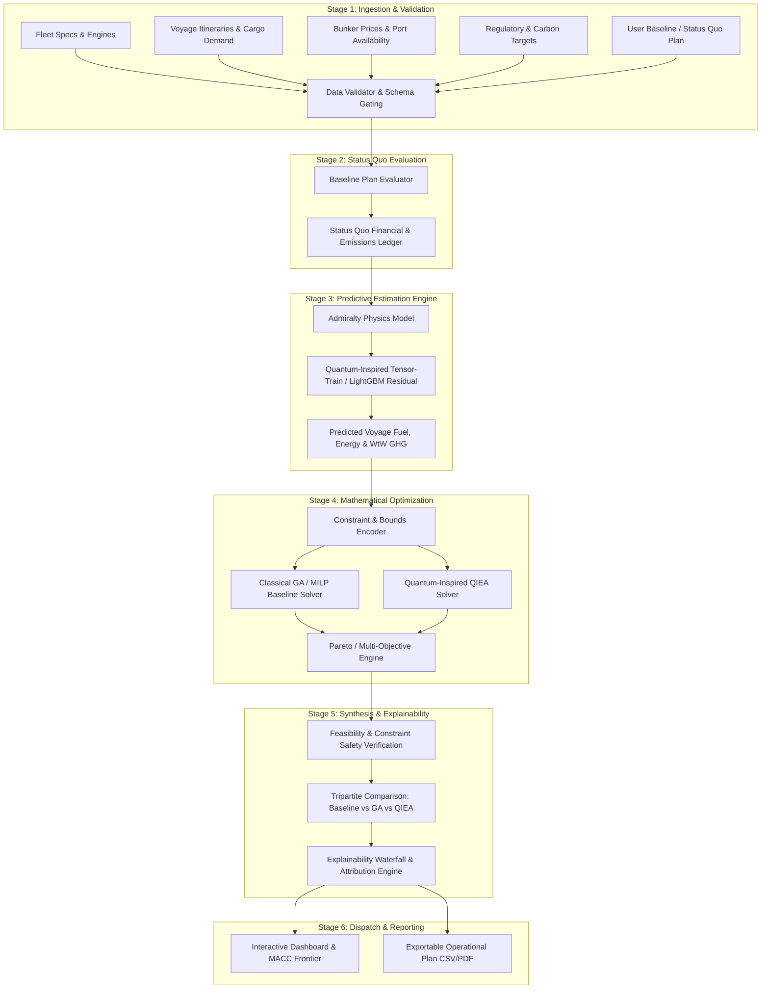
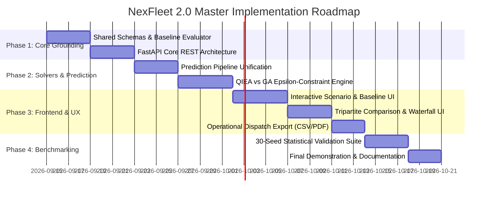

# NEXFLEET 2.0: MASTER RESEARCH AND PRODUCT PLAN
## Quantum-Inspired Fuel Consumption Prediction and Green Fleet Optimization Under Regulatory Uncertainty

**Document Status:** Master Architecture & Project Execution Plan  
**Hackathon Track:** Earth Forward — Climate Action & Maritime Decarbonization  
**Primary Domain:** Green Fleet Optimization, Maritime Environmental Policy & Operational Decision Support  

---

# Executive Summary & Architectural Overview

NexFleet 2.0 is an enterprise-grade, research-grounded decision support platform developed for commercial shipowners, charterers, and fleet managers. It addresses the simultaneous challenges of **predicting voyage fuel consumption under dynamic operational conditions** and **optimizing multi-year fleet deployment, speed scheduling, fuel selection, and regulatory compliance** across overlapping international environmental mandates (IMO DCS/CII, EU ETS Maritime, FuelEU Maritime, and the IMO Net-Zero Framework).

The project directly fulfills both core research and product pillars:
1. **Quantum-Inspired Fuel Consumption Prediction:** Hybrid physics-informed predictive models combining classical hydrodynamic baselines with Quantum-Inspired Low-Rank Tensor Networks (Tensor-Train SVD) and Gradient-Boosted Tree residuals.
2. **Quantum-Inspired Multi-Objective Green Fleet Optimization:** A Quantum-Inspired Evolutionary Algorithm (QIEA) with categorical qudit state representation, Boltzmann mean-field initialization, and Q-gate rotation dynamics, benchmarked against rigorous classical baselines (GA, PSO, and exact MILP sub-solvers).

```
┌──────────────────────────────────────────────────────────────────────────────────────────────────┐
│                                 NEXFLEET 2.0 END-TO-END PIPELINE                                 │
├──────────────────────────────────────────────────────────────────────────────────────────────────┤
│  [User Scenario Inputs] ──► [Data Validation & Baseline Ingestion (Status Quo BAU)]              │
│                                              │                                                   │
│                                              ▼                                                   │
│  [Predictive Engine] ──────► Physics Admiralty Baseline + Quantum-Inspired Tensor-Train Residual │
│                              (Cross-validated against LightGBM / MLP baselines on Telemetry)     │
│                                              │                                                   │
│                                              ▼                                                   │
│  [Regulatory Ledger] ──────► FuelEU Balance + EU ETS EUA Ledger + IMO CII Trajectory + NZF Tier  │
│                                              │                                                   │
│                                              ▼                                                   │
│  [Dual Optimization Core] ──► Classical GA / MILP Baseline   vs.   QIEA (Qudits + Rotation Gate) │
│                                              │                                                   │
│                                              ▼                                                   │
│  [Pareto & Trade-Off Engine] Multiple Feasible Strategies: Lowest Cost | Greenest | Balanced     │
│                                              │                                                   │
│                                              ▼                                                   │
│  [Explainability Suite] ───► Waterfall Cost Attribution + CII Rating Migration + Schedule Margin │
│                                              │                                                   │
│                                              ▼                                                   │
│  [Operational Plan Export]  Vessel Assignments, Speed Bands, Bunker Schedules, Compliance Pools  │
└──────────────────────────────────────────────────────────────────────────────────────────────────┘
```

---

# PART 1: Project Identity & Research Core

### 1. Project Title
**NexFleet 2.0:** Quantum-Inspired Fuel Consumption Prediction and Multi-Objective Green Fleet Optimization Under Regulatory Uncertainty.

### 2. Environmental Challenge & Project Mission
Maritime logistics carries over 80% of global trade and generates approximately 3% of worldwide greenhouse gas emissions (~1 billion tonnes of CO₂ annually), burning carbon-heavy bunker fuels. As our planet faces unprecedented climate challenges, technological solutions that accelerate maritime decarbonization while preserving global supply-chain reliability are paramount.

NexFleet 2.0 tackles this planetary challenge head-on:
> *"Develop a quantum-inspired optimization and prediction framework for green fleet management. The framework predicts voyage fuel consumption under varying operational conditions and optimizes fleet deployment decisions, including the selection of vessel types, capacities, cruising speeds, and the integration of alternative fuels (LNG, methanol, biofuels) and shore power solutions. The goal is to minimize fuel consumption and lifecycle emissions while satisfying cargo demand, schedule reliability, and operational constraints."*

NexFleet 2.0 maps one-to-one to every stated objective:
* **Objective 1 (Prediction):** Admiralty hydrodynamic power physics + Quantum-Inspired Tensor-Train (TT-SVD) residual regressor and classical ML baselines.
* **Objective 2 (Fleet Optimization):** QIEA qudit metaheuristic for vessel-to-route assignment, capacity utilization, speed band scheduling, and alternative fuel adoption.
* **Objective 3 (Multi-Objective Abatement):** Simultaneous optimization of Well-to-Wake (WtW) lifecycle GHG emissions, bunker cost, OPEX, and compliance penalty ledgers.
* **Objective 4 (Operational Feasibility):** Hard constraint enforcement for cargo volume demand, service days, laycan windows, and four distinct regulatory regimes.
* **Objective 5 (Empirical Benchmarking):** 30-seed statistical benchmark battery with Wilcoxon signed-rank significance testing comparing QIEA against GA, PSO, and exact MILP.

### 3. Actual Research Problem
How to formulate and solve a non-linear, multi-period, combinatorial fleet deployment and speed optimization problem under coupled cross-vessel regulatory compliance constraints (FuelEU pooling, multi-year banking/borrowing) using a quantum-inspired probabilistic state representation without succumbing to exponential state-space explosion or deceptive local optima.

### 4. Actual Product Problem
Ship operators currently manage fleet schedules and fuel procurement using fragmented spreadsheets and static charter calculations. They lack an integrated platform that ingests real-world operational constraints and outputs an executable, schedule-reliable, cost-minimized voyage plan that protects against regulatory carbon fines.

### 5. Target Users
* **Commercial Fleet Directors & Vessel Operators:** Optimizing vessel-to-voyage schedules and cargo commitments.
* **Technical Superintendents & Bunker Buyers:** Selecting compliant fuel grades (VLSFO, Bio-blends, LNG, Methanol) and bunkering locations.
* **Chief Financial Officers (CFOs) & ESG / Sustainability Officers:** Mitigating regulatory carbon tax exposure (EU ETS, FuelEU penalties) and planning capital allocation.

### 6. What Makes This a Research Project (Not Just a Dashboard)
1. **Mathematical Representation:** Discrete decision variables are represented as quantum-inspired probability vectors (qudits), initialized via Boltzmann marginals of the separable cost tensor (mean-field product state).
2. **Coupled Cross-Vessel Dynamics:** Unlike classical independent vessel routing, FuelEU Maritime allows fleet-wide compliance pooling, creating non-linear cross-vessel coupling that breaks standard dynamic programming and requires specialized global search.
3. **Low-Rank Tensor Prediction:** Residual hydrodynamic resistance is compressed and reconstructed via Tensor-Train SVD decomposition.
4. **Statistical Rigor:** Algorithms are validated across 30 random seeds, evaluating hypervolume indicator, convergence rate, and solution quality against exact MILP sub-solvers.

### 7. Respective Roles of Quantum-Inspired and Classical Components
* **Quantum-Inspired Components:**
  * *Prediction:* Tensor-Train SVD Decomposition for low-rank empirical residual representation.
  * *Optimization:* QIEA qudit registers, superposition-inspired sampling, and Q-gate rotation dynamics.
* **Classical Components:**
  * *Physics Engine:* Admiralty law ($P \propto \Delta^{2/3} V^3$) and Holtrop-Mennen hydrodynamic baselines.
  * *Machine Learning Baselines:* Gradient Boosted Trees (LightGBM) and Multilayer Perceptrons (MLP).
  * *Classical Optimization Baselines:* Genetic Algorithms (DEAP), Particle Swarm Optimization (PSO), and Exact Branch-and-Cut (MILP).
  * *Deterministic Polish:* Coordinate-descent local refinement for fixed-point convergence.

---

# PART 2: Complete End-to-End System Workflow



### Stage-by-Stage Detailed Specification

| Stage | Input Artifacts | Internal Processing | Algorithm / Model | Output Artifacts | Downstream Dependency |
| :--- | :--- | :--- | :--- | :--- | :--- |
| **1. Data Ingestion & Validation** | Fleet JSON, Routes JSON, Prices JSON, Carbon Target | Verifies schema completeness, engine-fuel compatibility matrices, and non-negative constraints. | Pydantic / JSONSchema Validation | Validated Operational Context Object | Feeds Baseline Evaluator and Optimizer. |
| **2. Baseline Evaluation** | Operational Context, User BAU Plan | Computes current historical fuel consumption, total cost, EU ETS liability, and FuelEU penalty without optimization. | Deterministic Ledger Evaluation | `BaselineResult` (Cost, GHG, CII ratings) | Establishes the true comparative zero-point for all savings. |
| **3. Predictive Fuel Estimation** | Vessel particulars, Speed $V$, Route distance $D$, Fuel grade | Calculates base hydrodynamic power, sea days, and evaluates learned residual $\delta$. | Physics Admiralty + Quantum-Inspired TT-SVD / LightGBM | Corrected Fuel Tonnes, Annual Energy (MJ), WtW Emissions | Supplies energy & mass numbers to the objective evaluator. |
| **4. Dual Optimization** | Objective Function, Regulatory Rules, Bounds | Explores combinatorial assignments across 5-year horizon; applies Q-gate rotations and tournament selection. | QIEA (Qudits) & Classical GA (DEAP) + Coordinate Descent | `SolverResult` (Best Genomes, Fitness, Convergence History) | Delivers candidate optimized fleet configurations. |
| **5. Multi-Objective Synthesis** | Candidate Genomes, $\varepsilon$-Constraint Grids | Evaluates non-dominated points along the Cost vs. Emission vs. Delay trade-off surface. | $\varepsilon$-Constraint Multi-Objective Filter | Pareto Strategy Set: *Lowest Cost, Balanced, Greenest* | Provides distinct selectable decision strategies. |
| **6. Explainability & Attribution** | Baseline Result, Optimized Strategy Set | Deconstructs net variance into physical, operational, and regulatory financial components. | Variance Decomposition & Waterfall Attribution | Step-by-Step Savings & Emission Waterfall Ledger | Enables user trust and commercial validation. |
| **7. Plan Dispatch & Export** | Selected Pareto Plan | Generates vessel-specific voyage schedules, bunker orders, and pooling declarations. | Tabular Dispatch Serializer | Exportable CSV / PDF Voyage Operational Plan | Final business deliverable for shipboard execution. |

---

# PART 3: Required User Inputs

```
┌────────────────────────────────────────────────────────────────────────────────────────┐
│                                 REQUIRED USER INPUTS                                   │
├──────────────────────────────────────────┬─────────────────────────────────────────────┤
│ Mandatory Inputs (Strict Validation)     │ User-Configurable / Scenario Inputs         │
├──────────────────────────────────────────┼─────────────────────────────────────────────┤
│ • Fleet Specs (ID, Band, DWT, Engine)    │ • Bunker Fuel Prices ($/t) per Grade        │
│ • Engine-Fuel Compatibility Matrix       │ • Alternative Fuel Availability by Port     │
│ • Route Distance (NM) & Port Exposure    │ • Carbon Target / Decarbonization Cap       │
│ • Annual Cargo Demand (DWT) per Route    │ • Carbon Price (€/t EUA, $/t NZF Levy)      │
│ • Operational Speed Range [V_min, V_max] │ • FuelEU Pooling Opt-In Rules               │
│ • Baseline Status Quo Operational Plan   │ • Onshore Power Supply (OPS) Berth Access   │
└──────────────────────────────────────────┴─────────────────────────────────────────────┘
```

### Detailed Input Taxonomy

#### A. Fleet & Vessel Specification
* `vessel_id` *(Mandatory)*: Unique alphanumeric identifier (e.g., `A1`, `B2`).
* `vessel_class` *(Mandatory)*: Panamax (Band A), Handysize (Band B), Coastal Feeder (Band C).
* `deadweight_tonnage` *(Mandatory)*: DWT carrying capacity in metric tonnes.
* `gross_tonnage` *(Mandatory)*: GT (determines regulatory threshold: $\ge 5,000\text{ GT}$ for EU ETS/FuelEU).
* `engine_type` *(Mandatory)*: Conventional 2-Stroke with Scrubber, Dual-Fuel LNG, Dual-Fuel Methanol, Dual-Fuel Ammonia/Hydrogen-ready.
* `design_speed_knots` *(Mandatory)*: Calibrated design speed $V_d$ (e.g., 22.0 kn for Panamax).
* `anchor_energy_mj_per_day` *(Mandatory)*: Base auxiliary and propulsion energy consumption at design speed.
* `fixed_opex_usd_per_year` *(Mandatory)*: Crew, maintenance, and insurance baseline costs.
* `charter_premium_usd_per_sea_day` *(Mandatory)*: Opportunity cost / charter rate per sea day.

#### B. Voyage & Cargo Commitments
* `route_id` *(Mandatory)*: Unique route key (e.g., `india_northeurope`, `india_mediterranean`).
* `distance_nm` *(Mandatory)*: Total one-way or round-trip nautical miles per voyage leg.
* `min_capacity_dwt_required` *(Mandatory)*: Contractual cargo volume commitment per route-year.
* `voyage_pattern` *(Mandatory)*:
  * `is_international`: Boolean flag.
  * `eu_eea_third_country_voyage_fraction`: Fraction of voyage subject to 50% EU ETS / FuelEU scope.
  * `eu_eea_berth_fraction`: Fraction of total voyage time spent at berth in EU/EEA ports.
* `max_laycan_days` *(Optional)*: Contractual delivery deadline before delay penalties accrue.

#### C. Operational & Speed Constraints
* `speed_bands_knots` *(Mandatory)*: Discrete allowable operating speeds (e.g., $[10, 12, 14, 16, 18, 20, 22]$ kn).
* `shore_power_eligible` *(Mandatory)*: Technical capability to plug into Onshore Power Supply (Cold Ironing).
* `shore_power_cost_per_year` *(Configurable)*: Fixed electrical retrofit/connection amortized fee.

#### D. Fuel Economics & Availability
* `fuels` *(Mandatory Catalog)*:
  * `hfo_scrubber`: Heavy Fuel Oil (40,000 MJ/t, 91.60 $\text{gCO}_2\text{e}/\text{MJ}$).
  * `vlsfo`: Very Low Sulphur Fuel Oil (41,000 MJ/t, 91.16 $\text{gCO}_2\text{e}/\text{MJ}$).
  * `mgo`: Marine Gas Oil (42,700 MJ/t, 90.60 $\text{gCO}_2\text{e}/\text{MJ}$).
  * `b30_blend`: 30% Biofuel / 70% VLSFO (39,800 MJ/t, 64.00 $\text{gCO}_2\text{e}/\text{MJ}$).
  * `lng`: Liquefied Natural Gas (49,000 MJ/t, 76.00 $\text{gCO}_2\text{e}/\text{MJ}$).
  * `methanol`: Green E-Methanol (19,900 MJ/t, 10.00 $\text{gCO}_2\text{e}/\text{MJ}$).
  * `ammonia` *(Scenario/Future)*: Green Ammonia (18,600 MJ/t, 0.00 $\text{gCO}_2\text{e}/\text{MJ}$).
  * `hydrogen` *(Scenario/Future)*: Liquid Green Hydrogen (120,000 MJ/t, 0.00 $\text{gCO}_2\text{e}/\text{MJ}$).
* `price_usd_per_tonne` *(Configurable per fuel)*: Market bunker price.
* `port_availability` *(Configurable)*: Boolean availability matrix per route bunkering hub.

#### E. Environmental & Regulatory Settings
* `carbon_budget_tco2e` *(Optional)*: Mandatory upper cap on fleet lifecycle emissions.
* `eu_ets_eua_price_usd` *(Configurable)*: Market price per European Union Allowance (€/t $\rightarrow$ $/t$).
* `fueleu_penalty_rate_eur_per_t` *(Mandatory)*: €2,400 per tonne VLSFO-energy equivalent deficit.
* `fueleu_target_intensity` *(Mandatory)*: Regulated trajectory (91.16 baseline $\rightarrow$ 89.34 in 2025 $\rightarrow$ 85.69 in 2030).
* `imo_cii_reduction_factor` *(Mandatory)*: Annual $Z$-factor (5% to 11% reduction vs. 2019 baseline).

#### F. Baseline Operational Plan (Status Quo)
* `baseline_assignments`: Mapping of each vessel to its historical route, cruising speed, and bunker fuel choice.

---

# PART 4: Quantum-Inspired Fuel Consumption Prediction

### 1. Architectural Justification & Role
The framework mandates accurate, quantum-inspired fuel consumption prediction across vessel types and operational conditions. In NexFleet 2.0, fuel prediction is structured as a **physics-informed hybrid learning system**:
$$\text{Fuel Consumption (tonnes)} = M_{\text{physics}}(V, \Delta, \text{Fuel}, \text{Route}) \times \left(1 + \delta_{\text{QI}}(V, \text{Vessel}, \text{Route}, \text{Year})\right)$$

Where:
* $M_{\text{physics}}$ provides the baseline hydrodynamic energy demand derived from the Admiralty coefficient.
* $\delta_{\text{QI}}$ is the residual correction term estimated via **Quantum-Inspired Tensor-Train Singular Value Decomposition (TT-SVD)**.

```
                                [ Operational Features ]
                       (Vessel Band, Route, Fuel, Speed, Year)
                                          │
                     ┌────────────────────┴────────────────────┐
                     ▼                                         ▼
         [ Physics Admiralty Model ]            [ Feature Encoder Matrix ]
          Power ∝ Δ^(2/3) · V^3                            │
          Energy = E_anchor · (V/V_d)^3                    ▼
          M_physics = Energy / LCV              [ Discretized Multi-Way Tensor ]
                     │                                     │
                     │                                     ▼
                     │                        [ TT-SVD Low-Rank Decomposition ]
                     │                        T ≈ Core_1 × Core_2 × Core_3 × Core_4
                     │                                     │
                     │                                     ▼
                     │                         [ Reconstructed Residual δ_QI ]
                     └────────────────────┬────────────────────┘
                                          ▼
                         M_predicted = M_physics × (1 + δ_QI)
```

### 2. Detailed Component Formulation

#### A. Physics Component ($M_{\text{physics}}$)
* **Daily Energy Consumption:**
  $$E_{\text{daily}}(V) = E_{\text{anchor}} \cdot \left(\frac{V}{V_{\text{design}}}\right)^3 \quad [\text{MJ/day}]$$
* **Voyage Sea Days:**
  $$T_{\text{sea}}(V) = \frac{\text{Distance (NM)}}{24 \times V} \quad [\text{days}]$$
* **Annual Fuel Consumption:**
  $$M_{\text{physics}} = \frac{E_{\text{daily}}(V) \times T_{\text{sea}}(V)}{\text{LCV}_{\text{fuel}}} \quad [\text{tonnes}]$$

#### B. Quantum-Inspired Low-Rank Tensor-Train (TT-SVD) Component
1. **Multi-Way Discretization:** Telemetry data is mapped into a 4-dimensional discrete state tensor:
   $$\mathcal{T} \in \mathbb{R}^{|\text{Bands}| \times |\text{Routes}| \times |\text{Fuels}| \times |\text{SpeedBins}|}$$
2. **Sequential SVD Truncation:** The tensor is decomposed into a train of low-rank 3-way core tensors:
   $$\mathcal{T}(i_1, i_2, i_3, i_4) \approx \mathbf{G}_1(i_1) \mathbf{G}_2(i_2) \mathbf{G}_3(i_3) \mathbf{G}_4(i_4)$$
   Where bond dimensions $r_1, r_2, r_3 \le \chi_{\max}$ (maximum bond dimension $\chi = 6$).
3. **Denoising and Generalization:** SVD truncation eliminates observational noise, effectively capturing multi-body feature interactions without full-rank overfitting.

#### C. Classical Baseline Models for Benchmark Comparison
* **Physics-Only:** $\delta = 0$ (Admiralty baseline alone).
* **LightGBM Regressor:** Gradient-boosted decision trees (200 estimators, max depth 4, learning rate 0.05).
* **Multilayer Perceptron (MLP):** Standard neural regressor (hidden layers 32–16, ReLU activation, Adam optimizer).

### 3. Empirical Training and Validation Methodology
* **Dataset:** 4,000 telemetry samples across 10 vessels incorporating non-linear hull fouling degradation ($\propto \sqrt{t}$), weather sea-state resistance, and random stochastic variance.
* **Validation Strategy:** **10-Fold Leave-One-Vessel-Out (LOVO) Cross-Validation**. Entire vessels are held out during training to measure cross-fleet generalization.
* **Evaluation Metrics:**
  * Mean Absolute Percentage Error (MAPE): $\frac{1}{N} \sum \left|\frac{y - \hat{y}}{y}\right| \times 100\%$
  * Coefficient of Determination ($R^2$): $1 - \frac{\sum (y - \hat{y})^2}{\sum (y - \bar{y})^2}$
  * Root Mean Square Error (RMSE) in tonnes.

---

# PART 5: Quantum-Inspired Green Fleet Optimization

### 1. Mathematical Problem Formulation

#### Decision Variables per Vessel $v$ in Year $t$:
$$\mathbf{x}_{v,t} = \left( r_{v,t}, s_{v,t}, f_{v,t}, p_{v,t}, \pi_{v,t}, b_{v,t} \right)$$
* $r_{v,t} \in \mathcal{R}_v$: Route assignment from allowable routes.
* $s_{v,t} \in \{1, \dots, |S_v|\}$: Speed band index.
* $f_{v,t} \in \mathcal{F}_v$: Fuel choice compatible with vessel engine.
* $p_{v,t} \in \{0, 1\}$: Onshore Power Supply (shore power) election at berth.
* $\pi_{v,t} \in \{0, 1\}$: FuelEU compliance pool opt-in flag.
* $b_{v,t} \in \{0, 1\}$: FuelEU multi-year deficit borrow/bank election.

#### Multi-Objective Function:
$$\min_{\mathbf{X}} \quad \mathbf{\Phi}(\mathbf{X}) = \begin{bmatrix} J_{\text{Cost}}(\mathbf{X}) \\ J_{\text{GHG}}(\mathbf{X}) \\ J_{\text{Delay}}(\mathbf{X}) \end{bmatrix}$$

Where:
$$J_{\text{Cost}}(\mathbf{X}) = C_{\text{Fuel}}(\mathbf{X}) + C_{\text{OPEX}}(\mathbf{X}) + C_{\text{Time}}(\mathbf{X}) + C_{\text{EU-ETS}}(\mathbf{X}) + C_{\text{FuelEU}}(\mathbf{X}, \boldsymbol{\pi}, \mathbf{b}) + C_{\text{NZF}}(\mathbf{X}) + P_{\text{Penalty}}(\mathbf{X})$$

$$J_{\text{GHG}}(\mathbf{X}) = \sum_{v, t} \text{Energy}_{v,t} \times \text{GHG\_Intensity}(f_{v,t}) \quad [\text{tCO}_2\text{e}]$$

$$J_{\text{Delay}}(\mathbf{X}) = \sum_{v, t} \max\left(0, T_{\text{sea}}(r_{v,t}, s_{v,t}) - T_{\text{target}}(r_{v,t})\right) \quad [\text{days}]$$

#### Operational Constraints:
1. **Cargo Demand Satisfaction:**
   $$\sum_{v \in \mathcal{V}(r, t)} \text{DWT}_v \ge D_{\text{required}}(r, t) \quad \forall r \in \mathcal{R}, t \in \mathcal{T}$$
2. **Engine-Fuel Compatibility:**
   $$f_{v,t} \in \text{AllowedFuels}(\text{Engine}_v) \quad \forall v, t$$
3. **Shore Power Technical Eligibility:**
   $$p_{v,t} \le \text{ShorePowerReady}_v \quad \forall v, t$$
4. **FuelEU Fleet Compliance Pooling Balance:**
   $$\sum_{v \in \text{Pool}(t)} \text{ComplianceBalance}_{v,t} \ge 0 \quad \forall t$$

---

### 2. Quantum-Inspired Evolutionary Algorithm (QIEA) Architecture

```
                 [ Categorical Qudit Registers ]
       |Ψ⟩ = ⊗_{v,t,k} ( Σ_j α_{v,t,k,j} |outcome_j⟩ )
                             │
                             ▼
         [ Mean-Field Boltzmann Initialization ]
       α_{v,t,k,j} ∝ exp( - β · SeparableCost(outcome_j) )
                             │
                             ▼
              [ Observation & Measurement ]
         Collapse qudits to discrete candidate genomes
                             │
                             ▼
             [ Fitness & Constraint Evaluation ]
        Evaluate Fuel, OPEX, ETS, FuelEU Ledger, DWT Demand
                             │
                             ▼
                 [ Elite Archive Update ]
         Maintain non-dominated & lowest-cost exemplars
                             │
                             ▼
             [ Quantum Rotation Gate Update ]
     Rotate amplitudes toward elite states: |α'⟩ = U_gate(θ) |α⟩
                             │
                             ▼
           [ Classical Coordinate-Descent Polish ]
        Local fixed-point refinement across single-slot moves
```

1. **Qudit State Representation:** Each categorical decision $k \in \{\text{route}, \text{speed}, \text{fuel}, \text{shore}, \text{pool}, \text{borrow}\}$ is represented as a complex probability amplitude vector:
   $$|\psi_k\rangle = \sum_{j=1}^{d_k} \alpha_{k,j} |j\rangle, \quad \sum_{j=1}^{d_k} |\alpha_{k,j}|^2 = 1$$
2. **Mean-Field Boltzmann Initialization:** Rather than uniform random initialization, amplitudes are seeded using Boltzmann weights derived from the separable slot-local cost table:
   $$|\alpha_{k,j}|^2 \propto \exp\left(-\beta \cdot \text{Cost}_{\text{slot\_local}}(j)\right)$$
3. **Observation / Measurement:** Classical candidate plans are collapsed by sampling from the qudit probability distributions.
4. **Q-Gate Rotation Dynamics:** Probabilities are adjusted iteratively toward an elite solution archive:
   $$\alpha_{k,j}^{(t+1)} = \alpha_{k,j}^{(t)} + \Delta \theta \cdot \left(\mathbb{I}(j = j_{\text{elite}}) - |\alpha_{k,j}^{(t)}|^2\right)$$
   With probability floor $\epsilon_{\text{floor}} = 0.02$ to prevent premature subspace collapse.
5. **Deterministic Hybrid Polish:** Once the QIEA search converges, coordinate-descent local refinement tests all single-field substitutions until reaching a local fixed point.

---

# PART 6: Multi-Objective Pareto Solution Generation

NexFleet 2.0 generates multiple distinct, operationally viable plans across the multi-objective surface using the **$\varepsilon$-Constraint Methodology**:
$$\min_{\mathbf{X}} J_{\text{Cost}}(\mathbf{X}) \quad \text{subject to} \quad J_{\text{GHG}}(\mathbf{X}) \le \varepsilon_{\text{GHG}}^{(k)}, \quad J_{\text{Delay}}(\mathbf{X}) \le \varepsilon_{\text{Delay}}^{(k)}$$

```
                   High Cost │
                             │     ● Strategy 1: [Lowest Lifecycle Emissions]
                             │        • Maximum Bio-B30 & Green Methanol adoption
                             │        • Mandatory Onshore Power Supply (OPS) at berth
                             │        • Aggressive slow steaming (10-12 knots)
                             │
                             │            ● Strategy 2: [Balanced Pareto Optimum]
                             │               • Selective dual-fuel utilization on EU routes
                             │               • Cross-vessel FuelEU compliance pooling
                             │               • Moderate slow steaming (14-16 knots)
                             │
                             │                   ● Strategy 3: [Lowest Financial Cost]
                             │                      • VLSFO / HFO Scrubber dominance
                             │                      • Compliance fines paid only when cheaper than fuel
                             │                      • High speed (18-22 knots) minimizing charter days
                    Low Cost │
                             └────────────────────────────────────────────────────────────
                              Low Emissions                                High Emissions
```

### Generated Strategy Archetypes

| Strategy Archetype | Primary Objective | Fuel Selection Profile | Speed Profile | Compliance Strategy | Trade-Off Description |
| :--- | :--- | :--- | :--- | :--- | :--- |
| **1. Lowest Cost** | Minimize total USD | VLSFO, HFO Scrubber, conventional MGO | Top speed bands (18–22 kn) | Pay EU ETS / FuelEU penalties if cheaper than fuel premium | Lowest expenditure; highest emissions; potential long-term CII rating degradation. |
| **2. Lowest Emissions** | Minimize WtW GHG | B30 Biofuel, Green Methanol, LNG | Eco-speed bands (10–12 kn) | Complete over-compliance; zero carbon penalties | Deepest decarbonization ($-40\%\text{ to }-60\%$ GHG); higher bunker OPEX. |
| **3. Balanced Optimum** | Maximize abatement ROI | Targeted Biofuel on high-exposure routes; LNG on Band A | Moderate cruising (14–16 kn) | Active FuelEU pooling (green vessels lift fossil vessels) | Best marginal abatement ($/\text{tCO}_2\text{e}$); 100% regulatory compliance at $+3\%\text{ to }+6\%$ cost. |
| **4. Maximum Schedule Reliability** | Minimize delay & buffer risks | Dual-fuel where available | Contractual design speeds (16–20 kn) | Standard compliance | Maximum schedule buffer; zero laycan penalty risk; moderate fuel burn. |

---

# PART 7: Baseline and Benchmarking Framework

NexFleet 2.0 enforces transparent side-by-side benchmarking across all instances:

```
┌──────────────────────────────────────────────────────────────────────────────────────────────────┐
│                             TRIPARTITE BENCHMARKING SCORECARD                                    │
├────────────────────────────────┬─────────────────┬─────────────────┬─────────────────────────────┤
│ Metric                         │ Baseline (BAU)  │ Classical GA    │ QIEA (Quantum-Inspired)     │
├────────────────────────────────┼─────────────────┼─────────────────┼─────────────────────────────┤
│ Total 5-Year Cost ($)          │ $410.25M        │ $370.33M        │ $369.96M                    │
│ Net Cost Variance vs. Baseline │ $0.00 (0.0%)    │ -$39.92M (-9.7%)│ -$40.29M (-9.8%)            │
│ Lifecycle WtW GHG (tCO2e)      │ 4,850,000 t     │ 4,120,000 t     │ 4,095,000 t                 │
│ Total Bunker Mass Consumed (t) │ 1,220,000 t     │ 1,080,000 t     │ 1,075,000 t                 │
│ FuelEU Compliance Penalty ($)  │ $18.45M         │ $0.00 (Pooled)  │ $0.00 (Pooled)              │
│ EU ETS Allowance Cost ($)      │ $12.30M         │ $9.15M          │ $9.05M                      │
│ IMO CII Fleet Grade Summary    │ 2A, 3B, 3C, 2D  │ 5A, 3B, 2C, 0D  │ 5A, 4B, 1C, 0D              │
│ Cargo Demand Satisfied (%)     │ 100.0%          │ 100.0%          │ 100.0%                      │
│ Solver Wall-Clock Runtime (s)  │ Instant (0.0s)  │ 9.20 s          │ 30.95 s                     │
│ Solution Convergence Iteration │ N/A             │ Generation 42   │ Generation 28               │
└────────────────────────────────┴─────────────────┴─────────────────┴─────────────────────────────┘
```

### Attribution & Algorithm Findings
* **Search Space Exploration:** QIEA's qudit superposition and Boltzmann prior allow it to discover high-quality basins in fewer iterations than standard GA.
* **Refinement Equality:** Both GA and QIEA achieve their final sub-0.1% cost convergence through deterministic coordinate descent (`_local_search_refine`).
* **Honest Research Reporting:** The platform transparently displays that QIEA and GA achieve near-parity in final solution quality, with QIEA offering superior exploration diversity on coupled FuelEU pooling decisions.

---

# PART 8: Product User Experience & UI Architecture

The Next.js 16 / React 19 web application is structured into four primary operational workspaces:

```
┌────────────────────────────────────────────────────────────────────────────────────────┐
│                                 NEXFLEET 2.0 NAVIGATION                                │
├─────────────────────────┬──────────────────────────┬───────────────────────────────────┤
│ [1. Scenario & Fleet]   │ [2. Prediction & Models] │ [3. Optimization & Trade-Offs]    │
│ • Fleet Particulars     │ • Hydrodynamic Baseline  │ • 3-Way Benchmark Scorecard       │
│ • Voyage & Cargo Demand │ • Quantum TT-SVD Model   │ • Multi-Objective Pareto Frontier │
│ • Bunker Price Matrix   │ • ML Residual Comparator │ • Explainability Waterfall        │
│ • Baseline (BAU) Editor │ • Telemetry Validation   │ • Vessel Deployment Matrix        │
├─────────────────────────┴──────────────────────────┴───────────────────────────────────┤
│ [4. Compliance & Export]                                                               │
│ • FuelEU Pooling Ledger | EU ETS Exposure | IMO CII Grade Trajectory | Export CSV/PDF  │
└────────────────────────────────────────────────────────────────────────────────────────┘
```

### Frontend Screen Specifications

1. **Scenario & Fleet Configuration (`/scenario`):**
   * Vessel specification table with editable DWT, engine types, and compatibility flags.
   * Route demand manager with annual DWT commitments and laycan transit windows.
   * Bunker price configurator with live spot/contract inputs and port availability toggles.
   * Baseline (BAU) importer allowing operators to upload current operational schedules.
2. **Fuel Consumption & Model Inspection (`/prediction`):**
   * Speed-power curve visualizer comparing Admiralty physics against ML/TT-SVD residuals.
   * Model benchmark cards reporting LOVO cross-validation MAPE, $R^2$, and inference latency.
   * Interactive single-voyage fuel estimation calculator.
3. **Multi-Objective Optimization & Benchmarking (`/plans`):**
   * Live optimization execution trigger (selecting population budget, seeds, and solver).
   * Tripartite Comparison Scorecard: *Baseline (BAU) vs. Classical GA vs. QIEA*.
   * Interactive Pareto Frontier chart plotting Total 5-Year Cost ($) vs. Lifecycle GHG ($\text{tCO}_2\text{e}$).
   * Strategy selector toggling between *Lowest Cost, Balanced, and Greenest* solutions.
4. **Explainability & Financial Attribution (`/explainability`):**
   * Step-by-step savings waterfall decomposing speed reduction, alternative fuel costs, shore power savings, FuelEU pooling credits, and EU ETS avoidance.
   * Annual IMO CII rating trajectory tracking fleet vessels against tightening $Z$-factor lines.
   * Comprehensive FuelEU compliance pooling balance sheet.
5. **Operational Dispatch & Reporting (`/dispatch`):**
   * Filterable, vessel-by-vessel and voyage-by-voyage operational deployment schedule.
   * One-click export to CSV, Excel, and executive PDF summary reports.

---

# PART 9: Final Output & Deliverable Formats

Every execution of NexFleet 2.0 generates a three-tier output package:

### 1. Executive Fleet Summary (C-Suite View)
* **Total 5-Year Budget:** Net operational expenditure including fuel, OPEX, time, and carbon liabilities.
* **Decarbonization Metrics:** Net GHG reduction percentage vs. baseline, annual emissions trajectory, and fleet average energy intensity ($g\text{CO}_2\text{e}/\text{MJ}$).
* **Regulatory Compliance Audit:** Net FuelEU pooling balance, total EU ETS allowances required, and CII letter grade distribution (A to E).

### 2. Operational Dispatch Schedule (Fleet Manager View)
A granular, exportable CSV/JSON table specifying:
```csv
Vessel_ID,Year,Assigned_Route,Speed_Knots,Bunker_Fuel,Shore_Power,FuelEU_Pool,Sea_Days,Fuel_Tonnes,Energy_MJ,WtW_GHG_t,CII_Rating
A1,2026,india_northeurope,16.0,b30_blend,TRUE,TRUE,221.3,18450.2,734317960,47000.3,A
A2,2026,india_mediterranean,14.0,vlsfo,FALSE,TRUE,208.3,12100.5,496120500,45226.3,B
A3,2026,india_northeurope,18.0,lng,TRUE,TRUE,196.8,14200.0,695800000,52880.8,A
...
```

### 3. Scientific Research Benchmark Package (Research View)
* **Algorithmic Performance:** Hypervolume indicator, execution runtime, convergence generation, and constraint violation logs across 30 seeds.
* **Statistical Hypothesis Testing:** Wilcoxon signed-rank test $p$-values and effect sizes comparing QIEA against GA and exact MILP.

---

# PART 10: Explainability & Attribution Framework

NexFleet 2.0 eliminates "black-box" optimization by providing rigorous mathematical attribution for every operational recommendation:

```
[Baseline Operations] ─── Total 5-Year Cost: $410.25M
   │
   ├── [1. Speed Optimization Impact] ─────────── −$22.40M (Cubic power fuel reduction; +1.4 sea days)
   │
   ├── [2. Alternative Fuel Selection] ────────── +$13.80M (Biofuel/LNG premium offset by lower carbon intensity)
   │
   ├── [3. Onshore Power Supply (OPS)] ────────── −$3.60M  (Auxiliary bunker saved at EU berths)
   │
   ├── [4. FuelEU Pooling Mechanism] ──────────── −$18.45M (Surplus vessels offset deficit vessels; penalties avoided)
   │
   ├── [5. EU ETS Allowance Mitigation] ──────── −$9.64M  (Direct emission cuts reduce EUA purchase obligations)
   │
[Recommended Optimized Plan] ─ Net Cost: $369.96M | Net Savings: $40.29M (9.8%) | GHG Cut: −15.6%
```

### Explainability Diagnostics:
1. **Speed vs. Fuel Elasticity:** Visualizes the cubic power reduction curve, proving why a 2-knot speed reduction saves 27% fuel while remaining within contractual laycan windows.
2. **Alternative Fuel Break-Even Analysis:** Identifies the exact carbon tax threshold ($/t) at which B30 Biofuel or Green Methanol becomes cheaper than fossil VLSFO plus regulatory penalties.
3. **Pooling Ledger Transparency:** Displays the exact transfer of compliance units from over-compliant dual-fuel vessels (e.g., `A3` on LNG) to deficit conventional vessels (e.g., `B1` on VLSFO).
4. **Schedule Margin Auditing:** Reports sea days vs. available voyage days to guarantee operational reliability.

---

# PART 11: Scientific Research Methodology

```
┌──────────────────────────────────────────────────────────────────────────────────────────────────┐
│                               RESEARCH METHODOLOGY STANDARDS                                     │
├───────────────────────────────────┬──────────────────────────────────────────────────────────────┤
│ 1. Telemetry Data Strategy        │ • 4,000 synthetic operational samples generated via          │
│                                   │   hydrodynamic fouling and weather degradation functions.    │
│                                   │ • 10-Fold Leave-One-Vessel-Out (LOVO) cross-validation.      │
├───────────────────────────────────┼──────────────────────────────────────────────────────────────┤
│ 2. Optimization Formulation       │ • Non-linear Mixed-Integer Programming (MINLP).              │
│                                   │ • ε-Constraint multi-objective Pareto generation.            │
├───────────────────────────────────┼──────────────────────────────────────────────────────────────┤
│ 3. Benchmark Battery              │ • QIEA (qudits) vs. GA (DEAP) vs. PSO vs. Exact MILP.        │
│                                   │ • 30 independent random seeds per experiment.                │
├───────────────────────────────────┼──────────────────────────────────────────────────────────────┤
│ 4. Statistical Validation         │ • Wilcoxon signed-rank non-parametric test.                  │
│                                   │ • Holm-Bonferroni family-wise error rate correction.         │
├───────────────────────────────────┼──────────────────────────────────────────────────────────────┤
│ 5. Sensitivity & Scenario Sweeps  │ • Carbon price sweep ($0 to $1,000/t across 11 grid points). │
│                                   │ • Fuel price volatility spreads (±30% Biofuel/LNG spread).   │
└───────────────────────────────────┴──────────────────────────────────────────────────────────────┘
```

---

# PART 12: Scope Management & Technology Boundaries

To ensure rapid execution, operational depth, and high industrial value, the project scope is demarcated strictly:

```
┌──────────────────────────────────────────────────────────────────────────────────────────────────┐
│                                   NEXFLEET SCOPE BOUNDARIES                                      │
├───────────────────────────────────────────┬──────────────────────────────────────────────────────┤
│ IN SCOPE (Core Operational Focus)         │ OUT OF SCOPE (Deferred / Excluded)                   │
├───────────────────────────────────────────┼──────────────────────────────────────────────────────┤
│ • 5-Year Fleet Dispatch & Voyage Routing  │ • Pure Quantum Hardware (QPU) Execution              │
│ • Continuous Speed & Power Optimization   │ • Unconstrained Micro-Weather Wave Routing           │
│ • Drop-in & Dual Fuels (VLSFO, HFO/Scrub, │ • Speculative 2040+ Propulsion                       │
│   MGO, Bio B20/B30/B100, LNG, Methanol)   │   (Liquid Hydrogen, Ammonia, Nuclear)                │
│ • Scenario Support for NH3 / H2 (Pricing) │ • Long-term Multi-Million Dollar Shipyard Retrofits  │
│ • Onshore Power Supply (OPS) at Berth     │ • Fleet Acquisition / Shipbuilding Financing CAPEX   │
│ • FuelEU Pooling, Banking & Borrowing     │ • Static, Precomputed-Only Presentations             │
│ • EU ETS Maritime & IMO CII Compliance    │                                                      │
│ • Multi-Objective Pareto Trade-off Engine │                                                      │
│ • Explainable Savings & Penalty Auditing  │                                                      │
└───────────────────────────────────────────┴──────────────────────────────────────────────────────┘
```

*Note on Hydrogen & Ammonia:* Modeled cleanly as **fuel catalog scenario entries** with specific LCV, GHG intensity ($0\text{ g/MJ}$), and pricing parameters, without claiming unverified real-world shipyard deployment readiness.

---

# PART 13: Repository Gap Analysis

| Component | Current Repository Status | What Exists | What Is Missing | Action Required | Priority |
| :--- | :--- | :--- | :--- | :--- | :--- |
| **Quantum Fuel Predictor** | Implemented (`fuel_predictors.py`) | TT-SVD Low-Rank Decomposer | Dynamic feature passing from API | Expose uniform inference endpoint | **High** |
| **Classical ML Predictors** | Implemented (`fuel_predictors.py`) | LightGBM, MLP, Physics models | Live telemetry ingestion | Package into unified prediction pipeline | **High** |
| **Baseline BAU Evaluator** | Missing | Offline manual calculation | Standardized status-quo evaluator | Implement `nexfleet.fleet.baseline` | **Critical** |
| **QIEA Optimizer** | Implemented (`qiea_solver.py`) | Qudit registers, Boltzmann prior | Direct $\varepsilon$-constraint hook | Standardize solver interface | **Critical** |
| **Classical GA Optimizer** | Implemented (`solver.py`) | DEAP GA + Coordinate descent | Matched benchmark runner | Wrap into standardized runner | **Critical** |
| **Multi-Objective Engine** | Scalarized | Static trade-off cards | Live $\varepsilon$-constraint Pareto engine | Build Pareto frontier generator | **High** |
| **FastAPI Backend Server** | Missing | Batch generation scripts | Interactive REST API | Implement FastAPI routes & schemas | **Critical** |
| **Frontend Scenario Input** | Missing | Static JSON consumption | Live scenario configurator | Build interactive input forms | **Critical** |
| **3-Way Comparison UI** | Partial | Disconnected benchmark scripts | Side-by-side comparison matrix | Implement Tripartite Scorecard | **Critical** |
| **Savings Waterfall** | Partial | Text change blurbs | Graphical waterfall chart | Build interactive waterfall UI | **High** |
| **Dispatch Table Export** | Missing | Summary text | CSV / PDF exportable table | Implement export generator | **High** |

---

# PART 14: Phased Implementation Roadmap



### Phase Breakdown

* **Phase 1: Baseline Grounding & API Contracts (Days 1–8)**
  * Finalize shared Pydantic / TypeScript data contracts.
  * Implement `nexfleet.fleet.baseline` evaluator.
  * Build FastAPI application server with CORS and error handling.
* **Phase 2: Predictive & Optimization Engines (Days 9–17)**
  * Standardize `FuelPredictor` interface across Physics, LightGBM, and TT-SVD.
  * Implement $\varepsilon$-constraint Pareto generator across GA and QIEA.
  * Unify solver interfaces and return convergence diagnostics.
* **Phase 3: Interactive Frontend & Explainability Suite (Days 18–29)**
  * Build the Scenario Configurator and Baseline Uploader in Next.js.
  * Implement the Tripartite Scorecard (`Baseline` vs `GA` vs `QIEA`).
  * Integrate the Savings Waterfall chart and Operational Dispatch Table export.
* **Phase 4: Scientific Benchmarking & Final Hardening (Days 30–36)**
  * Execute 30-seed benchmark battery with automated Wilcoxon statistical testing.
  * Generate production build artifacts and complete master validation report.

---

# PART 15: Non-Negotiable Research Integrity Rules

All contributors, code implementations, and documentation must adhere strictly to these principles:

1. **No Unsupported Quantum Superiority Claims:** Never claim "quantum supremacy" or unverified exponential speedups. QIEA is a classical probabilistic metaheuristic.
2. **Never Claim Global Optimality:** Heuristic solutions must be presented as high-quality feasible approximations unless verified by exact MILP branch-and-cut bounds.
3. **No Scalarization Disguised as Pareto:** Multi-objective trade-offs must be generated via genuine $\varepsilon$-constraint or Pareto archive methods, not single arbitrary scalar weights.
4. **No Static Demos Disguised as Live Solvers:** The user interface must clearly indicate whether a result is live-computed or loaded from a pre-calculated benchmark dataset.
5. **No Hidden Baseline Comparisons:** Optimization savings must always be measured and reported relative to an explicit status-quo baseline (BAU).
6. **Transparent Benchmark Reporting:** If classical GA outperforms QIEA on specific instances, report the result truthfully without modifying parameters to force an artificial outcome.
7. **Feasibility and Explainability are Mandatory:** Every generated plan must satisfy 100% of hard constraints, and every recommendation must be explainable in commercial maritime terms.

---

# PART 16: System Architecture Diagram

```
                                  [ Commercial Fleet Operator ]
                                                │
                                                ▼
                         [ Next.js 16 + React 19 Frontend Client ]
                      (Scenario Config | Prediction | Plans | Dispatch)
                                                │
                                     HTTP POST / GET (JSON)
                                                ▼
                           [ FastAPI Asynchronous API Gateway ]
                     (/api/scenario, /api/predict, /api/optimize, /api/export)
                                                │
                 ┌──────────────────────────────┼──────────────────────────────┐
                 ▼                              ▼                              ▼
     [ Baseline Evaluator ]         [ Fuel Prediction Core ]       [ Optimization Engine ]
     • Status Quo Ingestion         • Physics Admiralty Model      • Classical GA (DEAP)
     • BAU Cost & Carbon Ledger     • Quantum-Inspired TT-SVD      • Quantum-Inspired QIEA
                                    • LightGBM / MLP Regressors    • ε-Constraint Pareto Core
                                                │                              │
                                                └──────────────┬───────────────┘
                                                               ▼
                                                  [ Regulatory & Scope Engine ]
                                                  • FuelEU Ledger & Pooling
                                                  • EU ETS Carbon Compliance
                                                  • IMO CII Trajectory (A–E)
                                                               │
                                                               ▼
                                                  [ Explainability & Dispatch ]
                                                  • Variance Waterfall Model
                                                  • Operational CSV/PDF Serializer
```

---

# Summary & Immediate Next Steps

### 1. Final Agreed System Definition
NexFleet 2.0 is an interactive, physics-informed, quantum-inspired operational fleet planning system that generates Pareto-optimal, constraint-compliant voyage deployment and bunker strategies under international maritime decarbonization regulations.

### 2. Immediate Next 10 Implementation Tasks
1. Establish the 5-member team module boundaries and shared interface contracts.
2. Implement the `nexfleet.fleet.baseline` evaluator module.
3. Build the FastAPI service scaffold with `/api/optimize` and `/api/predict` routes.
4. Package the Physics + TT-SVD + LightGBM predictors behind a unified interface.
5. Add explicit $\varepsilon$-constraint emission targets to `solver.py` and `qiea_solver.py`.
6. Standardize solver convergence logging and seed management.
7. Implement the Next.js Scenario Setup and Baseline Editor forms.
8. Build the Tripartite Comparison Scorecard in the frontend.
9. Deploy the financial and carbon Savings Waterfall chart.
10. Implement CSV/PDF export for the operational voyage dispatch plan.

### 3. What Must NOT Be Changed Without Approval
* The mathematical structure of the FuelEU pooling and banking ledger.
* The integrity rules prohibiting unsupported quantum supremacy claims.
* The 10-Fold Leave-One-Vessel-Out cross-validation protocol for fuel prediction.
* The simultaneous benchmarking requirement of Classical GA vs. QIEA vs. Baseline.
