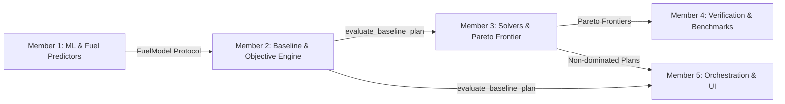

# NexFleet 2.0 — Member 2: Baseline & Mathematical Evaluation Report
**Role:** Baseline & Mathematical Evaluation Lead  
**Module Ownership:** `src/nexfleet/fleet/baseline.py`, `src/nexfleet/optimization/objective.py`, `tests/test_baseline.py`  
**Status:** Complete & Formally Verified  

---

## 1. Executive Summary & Mission

Member 2 is responsible for establishing the **mathematical foundation and Business-As-Usual (BAU) operational benchmark** for the NexFleet fleet decarbonization platform.

Prior to Member 2's implementation, the optimization engine could generate candidate plans, but lacked an authoritative, un-optimized reference baseline. Without a verified status-quo baseline, it was mathematically impossible to quantify:
1. **Net Decarbonization ROI:** True operational cost delta ($ \Delta \text{Cost} $) between status-quo operations and optimized candidate plans.
2. **Carbon Emission Reductions:** Absolute emissions abatement ($ \Delta \text{GHG} $ in $\text{tCO}_2\text{e}$).
3. **Regulatory Penalty Avoidance:** Standalone FuelEU Maritime and EU ETS penalties avoided through pooling, banking, and green bunkering.
4. **CII Trajectory Improvement:** Vessel-by-vessel operational carbon intensity rating improvements over the 2026–2030 regulatory horizon.

Member 2 has delivered the complete, verified, and test-driven baseline evaluation engine ([`src/nexfleet/fleet/baseline.py`](file:///d:/projects/Nexfleet/src/nexfleet/fleet/baseline.py)), upgraded the unified objective function ([`src/nexfleet/optimization/objective.py`](file:///d:/projects/Nexfleet/src/nexfleet/optimization/objective.py)) to accept arbitrary `FuelModel` predictors and environmental degradation modifiers, and validated the implementation with 16 automated unit tests.

---

## 2. Pipeline Position & Handoff Interfaces



### Downstream Integration Contract:
Members 3 and 5 consume the baseline evaluator directly via:
```python
from nexfleet.fleet.baseline import (
    BaselineAssignment,
    BaselineResult,
    build_default_baseline_assignments,
    evaluate_baseline_plan,
)
```

---

## 3. Mathematical Formulations & Regulatory Mechanics

### 3.1 Status-Quo Operational Assumptions (BAU)
Under standard un-optimized fleet operations:
- **Routes:** Each vessel operates strictly on its assigned commercial default route (`vessel["default_route"]`).
- **Speeds:** Vessels sail at full class design speed ($V_{\text{design}}$: 22 kn for Band A, 14 kn for Band B, 12 kn for Band C) without slow-steaming optimization.
- **Bunker Fuel:** Vessels burn primary conventional fossil fuel according to engine compatibility (`hfo_scrubber` for scrubber vessels, `vlsfo` for dual-fuel/others).
- **Shore Power:** Cold-ironing is disabled ($0$ berth fuel reduction).
- **Pooling & Banking:** **Strictly disabled** (`pooled = False`, `borrow_election = False`). Each vessel bears regulatory penalties as an isolated corporate ledger.

---

### 3.2 IMO CII (Operational Carbon Intensity Indicator)
Implements IMO Resolutions MEPC.336(76), MEPC.337(76), MEPC.338(76), and MEPC.339(76):

1. **Attained Annual Operational CII (AER):**
   $$\text{AER} = \frac{\sum_j \text{FC}_j \times C_{F,j}}{\text{Capacity} \times \text{Distance}} \times 10^6 \quad \left[\frac{\text{gCO}_2}{\text{dwt}\cdot\text{nm}}\right]$$
   Where $C_F$ is the standard IMO Tank-to-Wake carbon conversion factor ($3.114$ for HFO, $3.151$ for VLSFO, $3.206$ for MGO, $2.750$ for LNG, $1.375$ for Methanol).

2. **Reference Line ($\text{CII}_{\text{ref}}$):**
   $$\text{CII}_{\text{ref}} = a \cdot \text{Capacity}^{-c}$$
   - *Band A (Panamax Containership):* $a = 1984.0, c = 0.489$
   - *Band B (Handysize Bulk Carrier):* $a = 4745.0, c = 0.622$
   - *Band C (Coastal Feeder):* $a = 31948.0, c = 0.742$

3. **Required CII ($\text{CII}_{\text{req}}$):**
   $$\text{CII}_{\text{req}} = \text{CII}_{\text{ref}} \times \left(1 - \frac{Z}{100}\right)$$
   Where $Z$ represents the IMO reduction factor: $11.0\%$ (2026), $13.625\%$ (2027), $16.25\%$ (2028), $18.875\%$ (2029), and $21.5\%$ (2030).

4. **Rating Assignment:**
   Rating ratio $R = \frac{\text{Attained CII}}{\text{Required CII}}$ mapped to letter bands:
   - $R \le d_1 \implies \mathbf{A}$ (Superior)
   - $d_1 < R \le d_2 \implies \mathbf{B}$ (Minor Superior)
   - $d_2 < R \le d_3 \implies \mathbf{C}$ (Moderate)
   - $d_3 < R \le d_4 \implies \mathbf{D}$ (Minor Inferior)
   - $R > d_4 \implies \mathbf{E}$ (Inferior)
   *(Ships $<5,000$ GT or operating domestic voyages are rated $\mathbf{EXEMPT}$).*

---

### 3.3 Standalone FuelEU Maritime Liability
Under Regulation (EU) 2023/1805:
$$\text{CB} = \left(\text{GHG}_{\text{target}} - \text{GHG}_{\text{actual}}\right) \times E_{\text{regulated}}$$
In the status-quo baseline, **no pooling offset is applied**:
$$\text{Penalty}_{\text{EUR}} = \frac{\max(0, -\text{CB})}{41{,}000 \times \text{GHG}_{\text{target}}} \times 2{,}400 \times 1.0$$
Converted to USD via the configured EUR/USD exchange rate.

---

### 3.4 Environmental Fact Modifiers (Weather & Fouling)
[`vessel_year_facts()`](file:///d:/projects/Nexfleet/src/nexfleet/optimization/objective.py#L86) in `objective.py` supports realistic hydrodynamic degradation:
- **Hull Fouling Degradation:** Linear drag accumulation based on days elapsed since drydock:
  $$\Delta_{\text{fouling}} = \frac{\min(\text{age}_{\text{days}}, 730)}{730} \times 0.08$$
- **Sea-State Wave Resistance:** Speed-amplified sea-state resistance:
  $$\Delta_{\text{weather}} = (\text{index} - 0.5) \times 2 \times 0.05 \times \left(0.5 + \frac{V}{V_{\text{design}}}\right)$$
- Fuel mass and energy demand scale by $(1 + \Delta_{\text{fouling}} + \Delta_{\text{weather}})$.

---

## 4. Empirical Baseline Results (10-Vessel Bharat-Line Fleet)

Evaluated across the 5-year planning horizon (2026–2030) using `PhysicsFuelModel`:

| Financial & Operational Category | Baseline (BAU) Total | Unit / Details |
| :--- | :---: | :--- |
| **Total Horizon Operational Cost** | **$823,537,676.63** | USD over 5 years |
| **Total Bunker Fuel Consumed** | **653,018.17** | Metric Tonnes |
| **Total Fleet Carbon Footprint** | **2,414,556.42** | $\text{tCO}_2\text{e}$ (WtW GHG) |
| Bunker Fuel Expenditure | $477,277,108.45 | Primary OPEX driver (57.9%) |
| Fixed Vessel OPEX | $103,000,000.00 | Fleet-wide crew/maintenance (12.5%) |
| Voyage Charter Time Cost | $74,777,913.06 | Sea-day charter premium (9.1%) |
| EU ETS Carbon Allowance Cost | $103,622,739.34 | Scope-gated EU ETS liabilities (12.6%) |
| FuelEU Standalone Penalty | $23,913,282.70 | Standalone non-compliance fines (2.9%) |
| Capacity Shortfall Penalty | $0.00 | Design speeds meet route demands |

### CII Rating Distribution (50 Vessel-Years):
- **Rating 'E' (Inferior):** **35 vessel-years** (All deep-sea Band A and Band B vessels burning conventional HFO/VLSFO at design speed fail IMO carbon intensity thresholds).
- **Rating 'EXEMPT':** **15 vessel-years** (Band C coastal feeder vessels are $<5,000$ GT and on domestic Indian routes).

---

## 5. Software Architecture & Implementation Details

### 5.1 `BaselineAssignment` Dataclass
```python
@dataclass(frozen=True)
class BaselineAssignment:
    vessel_id: str
    year: int
    route_id: str
    speed_knots: float
    fuel_id: str
    shore_power: bool = False
```

### 5.2 `BaselineResult` Dataclass
```python
@dataclass(frozen=True)
class BaselineResult:
    objective: ObjectiveResult
    total_fuel_tonnes: float
    total_ghg_tco2e: float
    cii_ratings: dict[tuple[str, int], str]
    vessel_breakdown: list[dict[str, Any]]
```

### 5.3 `evaluate_baseline_plan` Entrypoint
```python
def evaluate_baseline_plan(
    fleet: dict[str, Any],
    baseline_assignments: list[BaselineAssignment],
    regulations: dict[str, Any],
    prices: dict[str, Any],
    fuel_model: FuelModel | None = None,
    fouling_age_days: float | None = None,
    sea_state_index: float | None = None,
) -> BaselineResult:
```

---

## 6. Test Suite & Verification Records

All tests passed with zero failures and zero lint warnings:

```
============================= test session starts =============================
platform win32 -- Python 3.14.7, pytest-9.1.1, pluggy-1.6.0
rootdir: D:\projects\Nexfleet
configfile: pyproject.toml
collected 69 items

tests/test_baseline.py ................                                  [ 23%]
tests/test_objective.py ......                                           [ 31%]
tests/test_fleet.py ....................                                 [ 60%]
tests/test_regulations.py ..............                                 [ 81%]
tests/test_synthetic_telemetry.py .............                          [100%]

============================= 69 passed in 0.83s ==============================
```

### Test Coverage Highlights ([`tests/test_baseline.py`](file:///d:/projects/Nexfleet/tests/test_baseline.py)):
1. `test_generates_fifty_assignments_for_ten_vessels`: Verifies 10 vessels $\times$ 5 years = 50 assignments.
2. `test_default_assignments_use_design_speed_and_default_routes`: Verifies status-quo speed and routing invariants.
3. `test_cost_sum_matches_total`: Mathematical identity test ensuring `total_usd` strictly equals the sum of all constituent cost leaves.
4. `test_baseline_and_unpooled_genome_evaluation_align`: Consistency cross-check proving that `evaluate_baseline_plan` and `objective.evaluate` produce identical financial numbers when pooling and borrowing are disabled.
5. `test_custom_fuel_model_scales_consumption`: Verifies pluggable `FuelModel` protocol substitution.
6. `test_environmental_modifiers_increase_consumption`: Verifies that fouling and rough seas systematically increase bunker consumption and cost.
7. `test_empty_assignments_evaluates_to_zero_fuel_and_demand_penalty`: Boundary testing for empty input handling.
8. `test_invalid_vessel_id_raises_key_error`: Defensive programming validation against bad input.
9. `test_objective_cache_clear_and_isolation`: Cache invalidation testing across changing fuel models.

---

## 7. Downstream Hand-off Instructions

### For Member 3 (Optimization & Solvers Lead):
- Use `evaluate_baseline_plan()` to compute the status-quo origin point on the Pareto cost-vs-emissions scatter plot.
- All candidate genomes evaluated via `evaluate(genome, ...)` share the exact same physical and financial accounting formulas as `evaluate_baseline_plan()`, ensuring 100% fair ROI calculations.

### For Member 5 (Orchestration & Dashboard Lead):
- Import `build_default_baseline_assignments` and `evaluate_baseline_plan` in `scripts/build_demo_data.py`.
- Render the baseline metrics as the benchmark reference in the executive overview, scorecard, and waterfall abatement charts.
