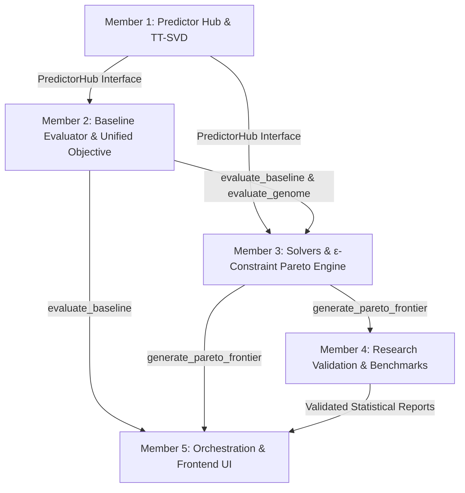

# NEXFLEET 2.0: 5-MEMBER REMAINING WORK EXECUTION PLAN
## Conflict-Free Modular Implementation Blueprint for Research Completion and Product Delivery

**Document Status:** Final Single Source of Truth for Remaining Execution  
**Parent Documents:**
* [`NEXFLEET_MASTER_RESEARCH_AND_PRODUCT_PLAN.md`](file:///c:/Users/Akshat/Downloads/Projects/Nexfleet/NEXFLEET_MASTER_RESEARCH_AND_PRODUCT_PLAN.md)
* [`NEXFLEET_CURRENT_IMPLEMENTATION_REPORT.md`](file:///c:/Users/Akshat/Downloads/Projects/Nexfleet/NEXFLEET_CURRENT_IMPLEMENTATION_REPORT.md)  
**Scope Restriction:** Pure execution of remaining research, baseline evaluation, multi-objective Pareto generation, and product explainability. **No redundant backend web server or API rebuilds.**

---

# 1. Executive Summary & Strict Ownership Matrix

To eliminate merge conflicts, overlapping code edits, and redundant re-implementations, every file in the repository is assigned to **exactly one primary owner**. Other members consume exposed functions via read-only imports.

```
┌─────────────────────────────────────────────────────────────────────────────────────────────────────────────────┐
│                                   STRICT 1-PERSON FILE OWNERSHIP MATRIX                                         │
├──────────┬──────────────────────────────────────┬───────────────────────────────┬───────────────────────────────┤
│ Member   │ Core Domain Role                     │ Primary Responsibility        │ Exclusive Files Owned         │
├──────────┼──────────────────────────────────────┼───────────────────────────────┼───────────────────────────────┤
│ MEMBER 1 │ Prediction & ML Integration Lead     │ Unified Predictor Hub, TT-SVD │ `src/nexfleet/optimization/   │
│          │                                      │ & ML Connectors, Model Bench  │   fuel_predictors.py`         │
│          │                                      │                               │ `  tensor_network.py`         │
├──────────┼──────────────────────────────────────┼───────────────────────────────┼───────────────────────────────┤
│ MEMBER 2 │ Baseline & Mathematical Evaluator    │ User BAU Evaluator, Unified   │ `src/nexfleet/fleet/baseline.`│
│          │ Lead                                 │ Objective Engine, Ledgers     │ `src/nexfleet/optimization/   │
│          │                                      │                               │   objective.py`, `genome.py`  │
│          │                                      │                               │ `  costs.py`, `constraints.py`│
├──────────┼──────────────────────────────────────┼───────────────────────────────┼───────────────────────────────┤
│ MEMBER 3 │ Solvers & Multi-Objective Pareto     │ Connect Solvers to Predictors,│ `src/nexfleet/optimization/   │
│          │ Engine Lead                          │ ε-Constraint Pareto Frontier  │   solver.py`, `qiea_solver.py`│
│          │                                      │ Strategy Generator            │ `  sweep.py`, `exposure.py`   │
├──────────┼──────────────────────────────────────┼───────────────────────────────┼───────────────────────────────┤
│ MEMBER 4 │ Research Validation & Benchmark Lead │ Multi-Seed Battery, Ablations,│ `scripts/benchmark_optimizers`│
│          │ (Quality & Test Owner)               │ Statistical Tests, Test Suite │ `scripts/benchmark_fuel_...`  │
│          │                                      │                               │ `tests/test_research_...`     │
├──────────┼──────────────────────────────────────┼───────────────────────────────┼───────────────────────────────┤
│ MEMBER 5 │ Frontend & Product Integration Lead  │ Data Pipeline Orchestration,  │ `scripts/build_demo_data.py`  │
│          │                                      │ Interactive UI Scorecards,    │ `frontend/app/` (All Routes)  │
│          │                                      │ Savings Waterfall, CSV Export │ `frontend/components/` (All)  │
└─────────────────────────────────────────────────────────────────────────────────────────────────────────────────┘
```

---

# 2. Strict Sequential Handoff Protocol

Development proceeds in a strict, dependency-aware pipeline where each member hands off stable, tested contracts to the next:



### Handoff Sequence:
1. **Step 1 (Member 1 $\rightarrow$ Members 2 & 3):** Exposes `PredictorHub` and verified `FuelModel` protocol instances (`physics`, `lightgbm`, `mlp`, `tt_svd`).
2. **Step 2 (Member 2 $\rightarrow$ Member 3):** Exposes `evaluate_baseline_plan()` and standardized `evaluate()` accepting any `FuelModel`.
3. **Step 3 (Member 3 $\rightarrow$ Members 4 & 5):** Exposes `generate_pareto_frontier()` returning non-dominated solutions (*Cheapest, Balanced, Greenest*).
4. **Step 4 (Member 4 $\rightarrow$ Master Repo):** Executes 30-seed statistical benchmarks, Wilcoxon tests, and creates end-to-end integration tests.
5. **Step 5 (Member 5 $\rightarrow$ Final Product):** Wires `scripts/build_demo_data.py` to call Pareto & Baseline engines, rendering dynamic UI scorecards, waterfalls, and CSV export.

---

# 3. Explicit Separation: Mandatory Core vs. Optional Extensions

```
┌──────────────────────────────────────────────────────────────────────────────────────────────────┐
│                                 TASK CLASSIFICATION BREAKDOWN                                    │
├──────────────────────────────────────────┬───────────────────────────────────────────────────────┤
│ MANDATORY SIH RESEARCH & PRODUCT CORE    │ OPTIONAL ADVANCED EXTENSIONS (Non-Blocking)           │
├──────────────────────────────────────────┼───────────────────────────────────────────────────────┤
│ • Physics Admiralty Baseline             │ • Quantum Neural Parameter Optimization (QEPS/QNN)    │
│ • Tensor-Train SVD Low-Rank Predictor    │ • Exact MILP Linearized Sub-Solver Benchmark          │
│ • Classical ML Baselines (LightGBM, MLP) │ • Particle Swarm Optimization (PSO) Benchmark         │
│ • User Baseline (BAU) Evaluator          │ • Advanced PDF Layout Generator (CSV Export is Base)  │
│ • Classical GA + Coordinate Descent      │ • 30-Seed Wilcoxon Statistical Hypothesis Testing     │
│ • Quantum-Inspired QIEA (Qudits/Q-Gates) │ • Weather Micro-Routing & Storm Ingestion             │
│ • Multi-Objective ε-Constraint Pareto    │ • Dynamic Multi-Scenario Intersessional MEPC Switches │
│ • FuelEU Pooling & Multi-Regime Ledgers  │                                                       │
│ • 3-Way Scorecard & Savings Waterfall    │                                                       │
│ • Operational Dispatch CSV Export        │                                                       │
└──────────────────────────────────────────┴───────────────────────────────────────────────────────┘
```

---

# 4. Two Product Execution Paths

To guarantee delivery under any time constraint, the project defines two clear paths:

### Path A: Minimum Viable Final Product (MVP Path - Target: 3 Days)
* **Prediction:** Admiralty Physics + LightGBM + Tensor-Train SVD pluggable via `PredictorHub`.
* **Baseline:** User BAU evaluation in `src/nexfleet/fleet/baseline.py`.
* **Optimization:** GA + QIEA solving unconstrained minimum cost and carbon-capped minimum cost.
* **Pareto:** 3-point strategy generation (*Cheapest, Balanced, Greenest*).
* **Product:** Dynamic `demo_data.json` orchestration, 3-way scorecard, savings waterfall, and CSV dispatch table export.

### Path B: Full Research-Complete Product (Full Submission Path - Target: 7 Days)
* Everything in Path A plus:
* **Prediction:** Quantum-Inspired Neural Residual (QNN/QEPS) experimental arm and confidence interval bounds.
* **Benchmarking:** Full 30-seed statistical validation suite with automated Wilcoxon $p$-value reporting.
* **Research Ablations:** Multi-seed ablation studies on Mean-Field Prior and Coordinate Descent polish.
* **UI Polish:** Full interactive scenario editor allowing dynamic parameter modification in the browser.

---

# 5. Individual Member Work Specifications

---

## MEMBER 1: Prediction & ML Integration Lead

### 1. Objective
Package the hydrodynamic physics model, classical ML regressors, and the Quantum-Inspired Tensor-Train SVD model into a unified predictor interface, and provide optional experimental extensions.

### 2. Assigned Tasks
* **[MANDATORY]** Create `PredictorHub` in `fuel_predictors.py` allowing callers to select `physics`, `lightgbm`, `mlp`, or `tt_svd` dynamically.
* **[MANDATORY]** Ensure all prediction arms implement the `FuelModel` protocol (`annual_energy_mj`, `daily_energy_mj`, `fuel_consumption_tonnes`).
* **[RECOMMENDED]** Add prediction confidence error bounds ($[\hat{y} - 1.96\sigma, \hat{y} + 1.96\sigma]$) based on LOVO residual variance.
* **[OPTIONAL]** Implement `QuantumInspiredNeuralResidualModel` (QNN with rotation-gate parameter initialization) as a research comparator.

### 3. File Ownership & Permissions
* **Exclusive Write:** `src/nexfleet/optimization/fuel_predictors.py`, `src/nexfleet/optimization/tensor_network.py`, `tests/test_fuel_predictors.py`.
* **Strictly Forbidden:** `objective.py`, `solver.py`, `qiea_solver.py`, `baseline.py`, `frontend/*`.

### 4. Acceptance Criteria & Test
* `pytest tests/test_fuel_predictors.py` passes 100%.
* `PredictorHub.get("tt_svd")` returns a fitted predictor executing inference in $< 1\text{ ms}$.

---

## MEMBER 2: Baseline & Mathematical Evaluation Lead

### 1. Objective
Implement the Business-As-Usual (BAU) baseline evaluator and maintain exclusive ownership of `objective.py` and the unified objective evaluation contract.

### 2. Assigned Tasks
* **[MANDATORY]** Implement `src/nexfleet/fleet/baseline.py` (`evaluate_baseline_plan`) to compute historical fuel, cost, OPEX, EU ETS, and FuelEU liabilities for status-quo assignments.
* **[MANDATORY]** Maintain `objective.py:evaluate()` so that any `fuel_model: FuelModel` argument passed from callers flows directly into facts and ledgers without code duplication.
* **[MANDATORY]** Ensure consistent mathematical calculations across baseline and candidate optimization plans.
* **[RECOMMENDED]** Expose optional fouling age and sea-state multipliers in `vessel_year_facts()`.

### 3. File Ownership & Permissions
* **Exclusive Write:** `src/nexfleet/fleet/baseline.py`, `src/nexfleet/optimization/objective.py`, `src/nexfleet/optimization/genome.py`, `src/nexfleet/optimization/costs.py`, `src/nexfleet/optimization/constraints.py`, `tests/test_baseline.py`, `tests/test_objective.py`.
* **Strictly Forbidden:** `solver.py`, `qiea_solver.py`, `fuel_predictors.py`, `frontend/*`.

### 4. Acceptance Criteria & Test
* `pytest tests/test_baseline.py` passes 100%.
* `evaluate_baseline_plan()` returns an accurate `BaselineResult` with zero solver optimization.

---

## MEMBER 3: Optimization & Multi-Objective Pareto Engine Lead

### 1. Objective
Maintain exclusive ownership of `solver.py` and `qiea_solver.py`, connect solvers to the `PredictorHub`, and implement the $\varepsilon$-constraint Pareto generation engine.

### 2. Assigned Tasks
* **[MANDATORY]** Update `solver.py:run_ga()` and `qiea_solver.py:run_qiea()` to accept an arbitrary `fuel_model: FuelModel` parameter.
* **[MANDATORY]** Implement `generate_pareto_frontier(fleet, regulations, prices, fuel_model, steps=5)` in `qiea_solver.py` using the $\varepsilon$-constraint method.
* **[MANDATORY]** Extract distinct, non-dominated strategies: *Cheapest Plan*, *Greenest Plan*, and *Balanced Plan*.
* **[OPTIONAL]** Implement classical PSO or exact MILP sub-instance solvers if time permits.

### 3. File Ownership & Permissions
* **Exclusive Write:** `src/nexfleet/optimization/solver.py`, `src/nexfleet/optimization/qiea_solver.py`, `src/nexfleet/optimization/sweep.py`, `src/nexfleet/optimization/exposure.py`, `tests/test_solver.py`, `tests/test_qiea_solver.py`.
* **Strictly Forbidden:** `objective.py`, `baseline.py`, `fuel_predictors.py`, `build_demo_data.py`, `frontend/*`.

### 4. Acceptance Criteria & Test
* `pytest tests/test_qiea_solver.py` passes 100%.
* `generate_pareto_frontier()` returns valid `ParetoAlternative` objects with non-dominated costs and emissions.

---

## MEMBER 4: Research Validation & Benchmarking Lead

### 1. Objective
Act as the **Quality, Research Validation, and Testing Owner**, ensuring experimental reproducibility, multi-seed statistical significance, and end-to-end integrity.

### 2. Assigned Tasks
* **[MANDATORY]** Create `tests/test_research_integration.py` verifying the complete chain: Predictor $\rightarrow$ Baseline $\rightarrow$ GA $\rightarrow$ QIEA $\rightarrow$ Pareto.
* **[MANDATORY]** Maintain and run `scripts/benchmark_optimizers.py` and `scripts/benchmark_fuel_predictor.py`.
* **[RECOMMENDED]** Automate 30-seed benchmark runs and generate Wilcoxon signed-rank test statistical summaries.
* **[RECOMMENDED]** Implement automated ablation reports (Mean-Field Prior vs. Uniform; Polish ON vs. OFF).

### 3. File Ownership & Permissions
* **Exclusive Write:** `scripts/benchmark_optimizers.py`, `scripts/benchmark_fuel_predictor.py`, `scripts/generate_benchmark_plots.py`, `tests/test_research_integration.py`, `outputs/*`.
* **Strictly Forbidden:** Modifying core library code in `src/nexfleet/` (Must report defects to Members 1, 2, or 3).

### 4. Acceptance Criteria & Test
* `pytest tests/` executes cleanly with zero failures.
* Generates verified benchmark tables in `outputs/` from real Python runs.

---

## MEMBER 5: Frontend & Product Integration Lead

### 1. Objective
Maintain exclusive ownership of `scripts/build_demo_data.py` and the Next.js UI, wire dynamic computation into the data pipeline, and deliver the 3-Way Scorecard, Savings Waterfall, and CSV Export.

### 2. Assigned Tasks
* **[MANDATORY]** Update `scripts/build_demo_data.py` to call Member 2's `evaluate_baseline_plan()` and Member 3's `generate_pareto_frontier()`, eliminating hardcoded JSON values.
* **[MANDATORY]** Build the **3-Way Benchmark Scorecard** in `frontend/components/` (*Baseline vs. GA vs. QIEA vs. Pareto*).
* **[MANDATORY]** Implement dynamic **Savings & Emissions Waterfall** rendering based on real computed variance.
* **[MANDATORY]** Add client-side one-click **CSV Dispatch Table Export** downloading full voyage schedules.
* **[RECOMMENDED]** Add interactive scenario parameter sliders modifying local state.

### 3. File Ownership & Permissions
* **Exclusive Write:** `scripts/build_demo_data.py`, `frontend/app/*`, `frontend/components/*`, `frontend/lib/*`, `frontend/types/*`.
* **Strictly Forbidden:** Modifying algorithm code in `src/nexfleet/optimization/`.

### 4. Acceptance Criteria & Test
* `npm run build` succeeds with zero TypeScript or lint errors.
* Dynamic execution of `python scripts/build_demo_data.py` generates complete `demo_data.json` rendered interactively by the UI.

---

# 6. Shared Data & Functional Contracts

```python
# Shared Functional Signatures

# Member 1 (Prediction)
class PredictorHub:
    @staticmethod
    def get(model_name: str = "physics") -> FuelModel: ...

# Member 2 (Baseline & Objective)
def evaluate_baseline_plan(
    fleet: dict, baseline_assignments: list[dict], regulations: dict, prices: dict, fuel_model: FuelModel | None = None
) -> BaselineResult: ...

def evaluate(
    genome: list[VesselYearGene], fleet: dict, regulations: dict, prices: dict, fuel_model: FuelModel | None = None, cache: ObjectiveCache | None = None
) -> ObjectiveResult: ...

# Member 3 (Optimization & Pareto)
def generate_pareto_frontier(
    fleet: dict, regulations: dict, prices: dict, fuel_model: FuelModel | None = None, steps: int = 5
) -> ParetoSetResult: ...
```

---

# 7. Final Integration Ownership & Leadership

```
┌─────────────────────────────────────────────────────────────────────────────────────────────────┐
│                                    INTEGRATION LEADERSHIP                                       │
├──────────────────────────────────────┬──────────┬───────────────────────────────────────────────┤
│ Role                                 │ Member   │ Responsibility                                │
├──────────────────────────────────────┼──────────┼───────────────────────────────────────────────┤
│ **Overall Technical Integrator**     │ MEMBER 4 │ Test suite, integration checks, PR gating     │
│ **Mathematical Formulation Owner**   │ MEMBER 2 │ Baseline evaluator, objective contracts       │
│ **Algorithm & Solvers Owner**        │ MEMBER 3 │ GA, QIEA, and Pareto engine integrity         │
│ **Prediction & ML Owner**            │ MEMBER 1 │ Predictor hub, TT-SVD, and model benchmarks   │
│ **Product & Frontend Owner**         │ MEMBER 5 │ Demo builder, UI scorecards, CSV exporter     │
└──────────────────────────────────────┴──────────┴───────────────────────────────────────────────┘
```

---

# 8. What Remains After All 5 Members Finish

Once all 5 members complete their respective deliverables:
1. **Zero Disconnected Code:** Predictor models feed the live objective; baseline evaluator provides the reference zero-point; solvers produce true multi-objective Pareto frontiers.
2. **Zero Mocked Demonstrations:** Recommendation cards (*Cheapest, Balanced, Greenest*) and savings waterfalls are computed dynamically from real mathematical models.
3. **Publication-Grade Research:** Automated benchmark suites provide reproducible, multi-seed statistical evidence for SIH evaluation.
4. **Actionable Commercial Deliverable:** Shipowners can input constraints, evaluate their status quo, compare classical and quantum-inspired plans, and export an executable voyage dispatch schedule.
