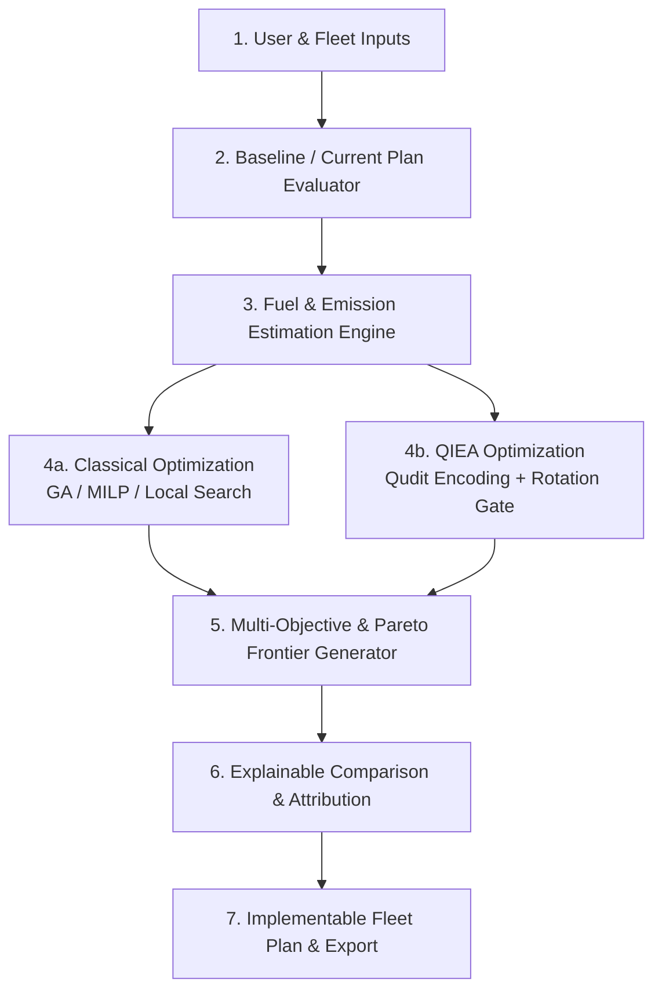
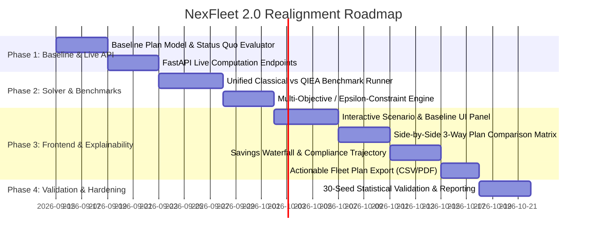

# NexFleet 2.0: Authoritative Research and Product Direction

**Document Status:** Approved Single Source of Truth  
**Target Architecture:** NexFleet 2.0 Operational Decision Support System  
**Application Domain:** Maritime Green Fleet Optimization & Regulatory Compliance  

---

## 1. Core Mission

NexFleet 2.0 is a specialized operational decision-support system designed to solve a fundamental challenge for commercial fleet owners, operators, and technical managers:

> **"Given my active fleet, cargo commitments, voyage routes, fuel options, bunker prices, operational constraints, and decarbonization targets, what concrete operational plan should I execute to minimize lifecycle GHG emissions and total operating cost while maintaining strict cargo delivery and schedule reliability?"**

NexFleet does not treat fleet optimization as an abstract theoretical toy problem or a static carbon-price sweep. It generates **actionable, constraint-compliant, multi-year and voyage-level operational fleet plans** that balance economic viability against tightening international maritime environmental regulations (IMO DCS/CII, EU ETS, FuelEU Maritime, and the IMO Net-Zero Framework).

---

## 2. Actual Research Contribution

To maintain scientific validity and industrial applicability, the research boundaries are defined as follows:

```
┌──────────────────────────────────────────────────────────────────────────────────┐
│                             NEXFLEET RESEARCH CORE                               │
├────────────────────────────────────────┬─────────────────────────────────────────┤
│ Primary Optimization Contribution      │ Supporting Estimation Component         │
│ • Quantum-Inspired Evolutionary        │ • Physics-Informed Classical ML         │
│   Algorithm (QIEA) with Qudit Encoding │   (Admiralty Formula + LightGBM/XGBoost │
│ • Mean-Field Boltzmann Initialization  │   Residual Regressors)                  │
│ • Pareto & ε-Constraint Multi-Objective│ • High-performance, interpretable,     │
│   Fleet Assignment & Speed Optimization│   validated on Leave-One-Vessel-Out CV  │
├────────────────────────────────────────┴─────────────────────────────────────────┤
│ Rigorous Baseline Benchmarks                                                     │
│ • Classical Genetic Algorithms (GA), Particle Swarm Optimization (PSO), and      │
│   Exact Mixed-Integer Linear Programming (MILP) on bounded sub-instances.        │
└──────────────────────────────────────────────────────────────────────────────────┘
```

1. **QIEA as the Primary Proposed Optimizer:** The core optimization engine employs a Quantum-Inspired Evolutionary Algorithm utilizing qudit probability vectors to represent discrete operational choices (route, speed band, fuel selection, shore power, pooling).
2. **Classical ML as the Supporting Predictor:** Vessel fuel consumption and energy demand are predicted using a hybrid **Physics Baseline (Admiralty / Holtrop-Mennen approximation) + Classical Gradient Boosted Residuals (LightGBM/XGBoost)**.
3. **No Artificial Quantum Prediction:** Quantum-inspired or tensor-network fuel consumption predictors are **not mandatory** for the research objective. Classical ML achieves superior accuracy with faster training and lower inference overhead; tensor-train models remain purely an offline academic benchmark.
4. **Classical Solvers are First-Class Benchmarks:** Classical algorithms (GA, MILP, heuristic search) are not treated as inferior strawmen. They serve as rigorous, fair, and identical-budget comparators.

---

## 3. Product & Operational Workflow

NexFleet executes an end-to-end, closed-loop decision lifecycle:



### Workflow Steps:
1. **User Inputs:** Fleet specifications, voyage itineraries, cargo requirements, fuel availability, bunker prices, and carbon reduction mandates are ingested.
2. **Baseline Evaluation:** The system evaluates the user's current status-quo operations (BAU) to establish the true financial and environmental zero-point.
3. **Predictive Estimation:** The physics-informed ML engine calculates voyage-by-voyage bunker consumption, sea days, port days, and Well-to-Wake (WtW) emissions.
4. **Dual Optimization:** Both classical optimizers and QIEA solve the identical operational assignment and speed optimization problem under identical constraints.
5. **Multi-Solution Synthesis:** Generates a set of distinct, non-dominated operational plans across the cost-emission-schedule Pareto surface.
6. **Explainable Comparison:** Quantifies exactly *why* and *how* the recommended strategy outperforms the baseline (decomposing fuel savings, speed cuts, penalty avoidance, and pooling benefits).
7. **Fleet Plan Dispatch:** Produces an exportable, vessel-by-vessel, voyage-by-voyage operational schedule ready for deployment.

---

## 4. Required User Inputs

A real fleet operator must be able to configure and inspect the following parameters using standard maritime industry terminology:

### A. Fleet & Vessel Specifics
* **Vessel Registry:** Vessel Name/ID, Vessel Class (e.g., Capesize, Panamax, Handysize, Feeder), Gross Tonnage (GT), Deadweight Tonnage (DWT).
* **Propulsion & Fuel Compatibility:** Engine type (Conventional 2-Stroke with Scrubber, Dual-Fuel LNG, Dual-Fuel Methanol, Biofuel-capable), compatible bunker grades.
* **Vessel Availability & Maintenance:** Drydock schedules, planned maintenance laytime, operational availability calendar.
* **Speed & Power Limitations:** Design speed, operational speed envelope ($V_{\min}$ to $V_{\max}$ in knots), ballast/laden consumption profiles.
* **Shore Connection:** Onshore Power Supply (OPS / Cold Ironing) readiness at berth.

### B. Voyage & Cargo Commitments
* **Route Itineraries:** Port pairs (origin, transits, destination), nautical distance (NM), standard sea-lane waypoints.
* **Cargo Demand & Deadlines:** Contract of Affreightment (CoA) volumes, minimum DWT required per route-year, laycan windows, maximum allowable ETA slippage.
* **Port Call Parameters:** Berth turnaround times, port congestion allowances, EU/EEA port exposure fractions (for EU ETS and FuelEU scope).

### C. Fuel Economics & Supply
* **Bunker Prices ($/tonne):** Spot and contractual prices for VLSFO, HFO (scrubber-equipped), MGO, Biofuel blends (B20/B30/B100), LNG, and Green/Bio-Methanol.
* **Bunker Availability by Port:** Geographic availability flags for alternative fuels (preventing the assignment of fuels at ports lacking supply infrastructure).

### D. Policy, Regulatory & Decarbonization Targets
* **Emissions Targets:** Fleet-level carbon budget ($\text{tCO}_2\text{e}$ cap) or corporate decarbonization trajectory.
* **Regulatory Parameters:**
  * **FuelEU Maritime:** Target GHG intensity ($g\text{CO}_2\text{e}/\text{MJ}$), compliance penalty rate (€2,400/t VLSFO-equivalent deficit), pooling rules, banking/borrowing elections.
  * **EU ETS Maritime:** EUA carbon allowance price (€/tonne $\text{CO}_2$), surrender phase-in percentages.
  * **IMO DCS / Carbon Intensity Indicator (CII):** Annual reduction factor ($Z$-factor), Required CII per vessel class, A–E rating thresholds.
  * **IMO Net-Zero Framework (NZF):** Flat or tiered carbon levy / remedial unit scenarios.

### E. Baseline Operational Plan (Status Quo)
* Current vessel-to-route assignments, current sailing speeds, current fuel choices, and historical bunker expenditure.

---

## 5. Required System Outputs

The system must **never** return a single black-box score. Instead, it must present **multiple feasible, transparent operational plans**:

```
                                  [PARETO FRONTIER]
               High Cost │
                         │     ● [Lowest Emission Plan]
                         │        (Max Bio/Methanol, Shore Power, Aggressive Slow Steaming)
                         │
                         │            ● [Balanced Cost-Emission Plan]
                         │               (Targeted Biofuels, Optimized Speed, FuelEU Pooling)
                         │
                         │                   ● [Lowest Cost Plan]
                         │                      (VLSFO/LNG, Compliance Penalties Minimized)
                Low Cost │
                         └────────────────────────────────────────────
                          Low Emissions                  High Emissions
```

### Core Strategy Profiles Delivered:
1. **Lowest Cost Strategy:** The absolute minimum total financial expenditure that fulfills all cargo commitments and legal compliance constraints.
2. **Lowest Emissions Strategy:** The maximum achievable GHG reduction utilizing maximum compatible zero/low-carbon fuels, shore power, and speed reduction within schedule limits.
3. **Balanced Cost-Emission Strategy:** The "sweet spot" on the Pareto front that achieves maximum marginal abatement (highest $\text{tCO}_2\text{e}$ cut per dollar spent).
4. **Maximum Schedule Reliability Strategy:** Prioritizes buffer time and minimal transit delay while minimizing fuel consumption within tighter speed bands.

### Granular Output Breakdown per Plan:
Every recommended plan must deliver:
* **Vessel-Level Execution Matrix:** Specific Route, Sailing Speed (knots), Assigned Fuel, Shore Power Election (Yes/No), and FuelEU Pooling Status per vessel per voyage/year.
* **Operational Performance:** Total Bunker Consumed (tonnes by fuel type), Sea Days, Port Days, Average Voyage Speed, and Cargo Demand Fulfillment (%).
* **Financial Ledger:** Bunker Fuel Cost ($), Fixed & Voyage OPEX ($), Charter Time Cost ($), EU ETS Allowance Cost ($), FuelEU Penalties/Credits ($), and Net Abatement Cost ($/\text{tCO}_2\text{e}$).
* **Decarbonization Metrics:** Well-to-Wake GHG Emissions ($\text{tCO}_2\text{e}$), Fleet Average Energy Intensity ($g\text{CO}_2\text{e}/\text{MJ}$), and Projected IMO CII Rating (A, B, C, D, or E) per vessel.

---

## 6. Transparent Tripartite Comparison: Baseline vs. Classical vs. QIEA

The platform must explicitly compare solutions side-by-side:

| Performance Dimension | Baseline Plan (Status Quo) | Classical Optimizer (GA / MILP) | Quantum-Inspired (QIEA) | Balanced Pareto Plan |
| :--- | :--- | :--- | :--- | :--- |
| **Total 5-Year Cost ($)** | *Historical / BAU* | *$X_{GA}$* | *$X_{QIEA}$* | *$X_{Bal}$* |
| **Total Bunker Mass (t)** | *BAU Tonnes* | *Tonnes ($-\Delta\%$)* | *Tonnes ($-\Delta\%$)* | *Tonnes ($-\Delta\%$)* |
| **Lifecycle GHG ($\text{tCO}_2\text{e}$)** | *BAU Baseline* | *Emissions ($-\Delta\%$)* | *Emissions ($-\Delta\%$)* | *Emissions ($-\Delta\%$)* |
| **FuelEU Compliance Position** | *Deficit / Penalty ($)* | *Optimized / Pooled ($)* | *Optimized / Pooled ($)* | *Surplus Banked ($)* |
| **EU ETS Financial Exposure** | *Full Exposure ($)* | *Mitigated ($)* | *Mitigated ($)* | *Mitigated ($)* |
| **IMO CII Grade Distribution** | *e.g., 2A, 3B, 3C, 2D* | *e.g., 4A, 4B, 2C, 0D* | *e.g., 4A, 5B, 1C, 0D* | *e.g., 6A, 4B, 0C, 0D* |
| **Cargo Demand Fulfilled** | 100% | 100% (Feasible) | 100% (Feasible) | 100% (Feasible) |
| **Average Schedule Margin (Days)**| *Baseline Days* | *Days ($-\Delta$)* | *Days ($-\Delta$)* | *Days ($-\Delta$)* |
| **Optimizer Runtime (Seconds)** | *N/A (Instant)* | *$T_{GA}$ seconds* | *$T_{QIEA}$ seconds* | *Pareto Sweep Time* |

### Absolute Research Rule on Optimizer Competition:
* **No Presumed Supremacy:** QIEA is **not** assumed to beat classical optimization automatically.
* **Honest Outcome Reporting:** If classical GA or MILP achieves a lower cost, faster runtime, or better stability on a given fleet instance, the system must report that outcome clearly and without bias.

---

## 7. Explainability & Attribution Architecture

When NexFleet recommends an operational change, it must provide a transparent, step-by-step audit trail answering **WHY** the change is recommended:

```
[Baseline Operations] ─── Total 5-Year Cost: $410.0M
   │
   ├── [1. Speed Optimization Impact] ─────────── −$22.5M (Cubic power fuel reduction; +1.2 sea days)
   │
   ├── [2. Alternative Fuel Selection] ────────── +$14.0M (Biofuel/LNG premium offset by lower carbon intensity)
   │
   ├── [3. Onshore Power Supply (OPS)] ────────── −$3.5M  (Auxiliary bunker saved at EU berths)
   │
   ├── [4. FuelEU Pooling Mechanism] ──────────── −$18.0M (Surplus vessels offset deficit vessels; no penalties)
   │
   └── [5. EU ETS Penalty Avoidance] ──────────── −$9.0M  (Direct emission cuts reduce EUA purchases)
   │
[Recommended Optimized Plan] ─ Net Cost: $371.0M | Net Savings: $39.0M (9.5%) | GHG Cut: −22.4%
```

### Essential Explainability Drivers:
1. **Speed vs. Fuel Non-Linearity:** Show the exact fuel-speed trade-off curve ($P \propto V^3$) demonstrating why a specific speed reduction is economically optimal without violating cargo transit windows.
2. **Fuel Transition Economics:** Explain when alternative fuel price premiums are justified by avoiding FuelEU penalty multipliers (€2,400/t) and EU ETS allowance costs.
3. **Pooling Mechanism Attribution:** Provide a full compliance balance sheet demonstrating how high-performing green vessels transfer compliance surplus to fossil-fueled vessels.
4. **Constraint Safety Margins:** Explicitly display the margin between scheduled sailing days and contractual laycan deadlines.

---

## 8. Research Methodology & Benchmarking Discipline

To maintain academic rigor and publishable research quality:

1. **Rigorous Problem Formulation:**
   * Formulate the problem mathematically as a Mixed-Integer Non-Linear Problem (MINLP) with discrete assignment variables, cubic continuous speed variables, and piecewise regulatory penalty functions.
2. **True Multi-Objective / $\varepsilon$-Constraint Optimization:**
   * Implement $\varepsilon$-constraint or multi-objective Pareto formulations ($\min \text{Cost}$ subject to $\text{GHG} \le \Gamma_k$) rather than arbitrary scalarized single-objective weight additions.
3. **Fair, Matched-Budget Benchmarking:**
   * Benchmark QIEA against GA, Particle Swarm Optimization (PSO), and exact branch-and-cut solvers (for linearized sub-instances) under **identical population sizes, evaluation budgets, and random seeds**.
4. **Statistical Significance:**
   * Evaluate all algorithmic benchmarks across a minimum of **30 independent random seeds**. Report mean, standard deviation, interquartile range, convergence plots, and Wilcoxon signed-rank significance tests with Holm-Bonferroni correction.
5. **No Unsupported Quantum Claims:**
   * Explicitly define QIEA as a classical heuristic sampling algorithm inspired by quantum probability mechanics. Do not claim quantum speedup, quantum entanglement, or hardware supremacy.

---

## 9. Scope Boundaries: In-Scope vs. Out-of-Scope

To ensure rapid delivery, operational depth, and high industrial value, the project scope is demarcated strictly:

```
┌────────────────────────────────────────────────────────────────────────────────────────┐
│                               NEXFLEET SCOPE BOUNDARIES                                │
├───────────────────────────────────────────┬────────────────────────────────────────────┤
│ IN SCOPE (Core Operational Focus)         │ OUT OF SCOPE (Deferred / Excluded)         │
├───────────────────────────────────────────┼────────────────────────────────────────────┤
│ • 5-Year Fleet Dispatch & Voyage Routing  │ • Pure Quantum Hardware (QPU) Execution    │
│ • Continuous Speed & Power Optimization   │ • Quantum Fuel Consumption Prediction      │
│ • Drop-in & Dual Fuels (VLSFO, HFO/Scrub, │ • Speculative 2040+ Propulsion             │
│   MGO, Bio B20/B30/B100, LNG, Methanol)   │   (Liquid Hydrogen, Ammonia, Nuclear)      │
│ • Onshore Power Supply (OPS) at Berth     │ • Long-term Shipyard Retrofit Planning     │
│ • FuelEU Pooling, Banking & Borrowing     │ • Fleet Acquisition / Shipbuilding CAPEX   │
│ • EU ETS Maritime & IMO CII Compliance    │ • Micro-level Weather Routing (Wave/Storm) │
│ • Multi-Objective Pareto Trade-off Engine │ • Static, Precomputed-Only Presentations   │
│ • Explainable Savings & Penalty Auditing  │                                            │
└───────────────────────────────────────────┴────────────────────────────────────────────┘
```

---

## 10. Prioritized Implementation Roadmap

Development will proceed in four focused phases:



### Phase 1: Baseline Grounding & Live API Architecture (Critical)
* Implement `nexfleet.fleet.baseline` to formalize, ingest, and evaluate the operator's current status quo.
* Build a lightweight FastAPI / Next.js backend bridge to allow dynamic live solves on custom inputs rather than relying on static JSON files.

### Phase 2: Solver Unification & Multi-Objective Engine (Critical)
* Standardize the solver interface so `run_ga()`, `run_qiea()`, and `run_milp()` accept identical inputs and return structured convergence logs.
* Implement $\varepsilon$-constraint optimization to generate true cost-emission Pareto curves.

### Phase 3: Interactive UI & Explainability Suite (Important)
* Build the **Scenario Configurator** and **Baseline Uploader** in the Next.js frontend.
* Implement the **Tripartite Comparison Scorecard** (`Baseline` vs `GA` vs `QIEA` vs `Pareto`).
* Deploy the **Savings Waterfall Chart** and **Voyage Plan Export Table**.

### Phase 4: Statistical Validation & Research Documentation (Important)
* Run full 30-seed statistical benchmarks across multiple fleet test instances.
* Generate automated research benchmark reports with Wilcoxon test results, runtime scaling curves, and convergence diagnostics.

---

## 11. Core Research Integrity Rules

All contributors, code implementations, and documentation must adhere strictly to these non-negotiable principles:

1. **Never Claim Universal Optimality:** Never state or imply that QIEA is universally superior to classical algorithms. Present empirical benchmark results truthfully.
2. **Never Claim Quantum Supremacy:** Never use misleading terminology such as "quantum speedup", "quantum supremacy", or "quantum entanglement advantage" when executing on classical CPUs.
3. **No Artificial Quantum Components:** Do not introduce tensor networks or quantum algorithms into components (like tabular fuel prediction) where standard classical methods are superior and more practical.
4. **No Scalarization Disguised as Pareto:** Do not present a single scalarized weighted-sum run as a multi-objective Pareto optimization. True multi-objective exploration requires multi-point Pareto or $\varepsilon$-constraint frontiers.
5. **No Static Data Disguised as Live Solves:** Ensure the user interface clearly distinguishes between pre-calculated benchmark datasets and active, live-computed fleet scenarios.
6. **Feasibility and Explainability are Mandatory:** Every generated plan must be mathematically feasible against all physical, operational, and regulatory constraints, and every recommendation must be explainable in clear maritime business terms.

---

*This document serves as the permanent build contract and architectural compass for NexFleet 2.0.*
