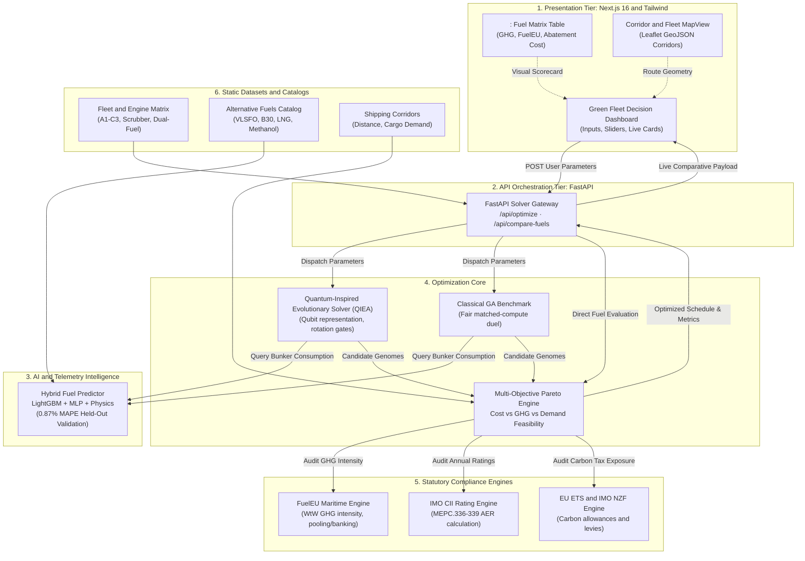

<h1 align="center">NexFleet</h1>

<p align="center">
  <strong>Fleet parameters in. Net-zero maritime strategy out.</strong><br />
  An intelligent decision-support platform combining physics-informed machine learning with quantum-inspired evolutionary optimization to help ocean fleet operators transition to clean alternative fuels and achieve zero-penalty compliance.
</p>

<p align="center">
  <a href="http://localhost:3000"><strong>Try the local web app</strong></a>
  ·
  <a href="http://localhost:8000/docs">Interactive API docs (Swagger)</a>
  ·
  <a href="#architecture">Architecture Diagram</a>
  ·
  <a href="#run-locally-and-reproduce-the-demo">Run locally in 2 minutes</a>
</p>

---

## Why NexFleet

Maritime shipping carries over 80% of global trade but burns heavy fossil bunker fuels, releasing over **1 billion tonnes of CO₂ annually** (~3% of total global greenhouse gas emissions). At the same time, the maritime sector is entering a transformative regulatory era governed by aggressive decarbonization mandates:

- **EU FuelEU Maritime:** Escalating penalties reaching €2,400/t deficit on fossil bunker GHG intensity.
- **IMO Carbon Intensity Indicator (CII):** Annual operational efficiency letter ratings ('A' through 'E') with commercial penalties and risk of trading revocation for low-tier ships.
- **EU Emissions Trading System (EU ETS):** Mandatory carbon allowance purchasing for voyages calling at EU ports.
- **IMO Net-Zero Framework (NZF):** Global greenhouse gas emission pricing levies.

Today, ship operators and charterers rely on fragmented spreadsheets, static rulebooks, and guesswork to plan fleet renewals and voyages. Choosing the wrong fuel or speed profile can cost an operator **millions of dollars in non-compliance fines** or lock them into premature, high-capex engine retrofits. 

**NexFleet automates this strategic bottleneck.** A fleet operator selects a vessel, sets economic and regulatory conditions, and receives an optimized, mathematically verified multi-year operating schedule with optimal clean fuel transitions, speed profiles, and regulatory compliance balances.

---

## What NexFleet does

1. **Input & Scenario Selection:** Select any fleet vessel (Container, Bulk Carrier, General Cargo), candidate bunker fuel, carbon price ($0–$500/tCO₂e), and annual cargo throughput multiplier.
2. **AI Bunker Prediction:** Physics-informed machine learning models (LightGBM, Multi-Layer Perceptron, Polynomial Regression) predict speed- and route-dependent fuel consumption with **0.87% MAPE**, verified by holding out entire unseen ships during training.
3. **Quantum-Inspired Evolutionary Search:** A Quantum-Inspired Evolutionary Algorithm (QIEA) uses qubit chromosomes and adaptive quantum rotation gates to explore the vast combinatorial decision space of fuels, speeds, routes, and cold-ironing across a 5-year operating horizon (2026–2030).
4. **Deterministic Multi-Regime Audit:** Statutory compliance engines compute statutory equations for FuelEU Maritime (including voluntary pooling and banking), IMO CII AER curves, EU ETS allowances, and NZF levies.
5. **Actionable Green Recommendation:** Delivers an instant side-by-side comparison between Business-As-Usual (BAU) operations and the greener schedule, alongside a **1-click Compatible Fuel Alternatives Scorecard** showing marginal abatement costs and break-even carbon prices.

---

### A real repository example

Evaluating a conventional containership (**Vessel A1**) over the 5-year horizon (2026–2030) under a $175/t carbon price:

| Operational Metric | Traditional Status Quo (HFO Scrubber) | Clean Drop-in Blend (B30 Biofuel) | Green e-Fuel (e-Methanol / Dual-Fuel) |
|---|---|---|---|
| **5-Year Lifecycle GHG** | 544.1k tCO₂e | **380.2k tCO₂e (−30.1%)** | **59.8k tCO₂e (−89.0%)** |
| **FuelEU Maritime Penalty** | **$6.91M penalty** | **$0.00 (100% Compliant)** | **$0.00 (100% Compliant)** |
| **IMO CII Letter Rating** | Rating D *(Revocation Risk)* | **Rating B *(Superior)*** | **Rating A *(Net-Zero Leader)*** |
| **Engine Retrofit Capex** | $0.00 | **$0.00 (Drop-in Ready)** | Requires Dual-Fuel Injection |
| **Marginal Abatement Cost** | Baseline | **$106.8 / tCO₂e abated** | $312.4 / tCO₂e abated |
| **Break-Even Carbon Price** | Baseline | **$281.8 / tCO₂e** | $487.2 / tCO₂e |

*Result:* NexFleet identifies that transitioning Vessel A1 to **B30 Biofuel Blend** eliminates the entire $6.91M FuelEU penalty with zero engine modification expenditure, cutting 163,953 tonnes of CO₂e at an immediate positive return.

---

## AI Predicts. Quantum-Inspired Algorithm Disposes.

NexFleet separates predictive intelligence from combinatorial search and statutory auditing:

- **Machine Learning Predictor:** Models real-world hydrodynamic friction, weather resistance, and fuel energy density. Models are benchmarked via Leave-One-Vessel-Out (LOVO) cross-validation to guarantee generalization to unseen hulls.
- **Quantum-Inspired Solver (QIEA):** Avoids classical genetic algorithm premature convergence by maintaining quantum superpositions of operational states. Qubits collapse toward Pareto-optimal trade-offs between financial cost and greenhouse gas emissions.
- **Classical GA Benchmark:** Runs in parallel with identical population, generations, and random seeds to provide a strict, fair baseline comparison.
- **Deterministic Statutory Gate:** Strict statutory formulas independently verify that every proposed fleet assignment clears minimum annual cargo demand, service availability, and safety thresholds.

---

## Architecture



The browser application (Next.js 16) communicates with the Python computational backend (FastAPI). The engine executes live evolutionary optimizations in seconds, cross-checks against deterministic statutory ledgers, and streams back comparative metrics without UI derivation.

---

## Built with

- **AI & Analytics:** LightGBM, Scikit-learn, NumPy, SciPy, Physics-Informed Resistance Models
- **Optimization Core:** Quantum-Inspired Evolutionary Algorithm (QIEA), Classical Genetic Algorithm (GA), Multi-Objective Pareto Frontier Sweep
- **Regulatory Engines:** Statutory ledgers for FuelEU Maritime (EU 2023/1805), IMO MEPC.336-339(76) CII, EU ETS Directive 2023/959, IMO Net-Zero Framework
- **Web App:** Next.js 16 (Turbopack), React 19, TypeScript, Tailwind CSS, Leaflet.js
- **API Server:** FastAPI, Uvicorn, Pydantic v2
- **Testing & Verification:** Pytest (320+ unit tests), LOVO Cross-Validation Benchmark Suite

---

## What inputs can I use?

NexFleet is designed for heterogeneous commercial ocean fleets across diverse operating profiles:

- **Vessel Bands:**
  - **Band A (Containerships):** High speed, strict liner transit deadlines, high power demand.
  - **Band B (Bulk Carriers):** Moderate speed, variable cargo densities, international trade.
  - **Band C (General Cargo / Feeders):** Regional routes, shorter legs, shore-power eligible.
- **Propulsion & Engine Types:** Conventional HFO with Scrubber, Dual-Fuel LNG, Dual-Fuel Methanol, Dual-Fuel Ammonia, Dual-Fuel Hydrogen.
- **Supported Fuels:** Heavy Fuel Oil (HFO), Very Low Sulphur Fuel Oil (VLSFO), Marine Gas Oil (MGO), Liquefied Natural Gas (LNG), B30 Biofuel Blend (30% zero-rated FAME), Green e-Methanol, Green Ammonia, Liquid Hydrogen.
- **Corridors:** Transpacific, Asia-Europe, Transatlantic, Feeder Inter-Port Networks.

---

## Run locally and reproduce the demo

### 1. Prerequisites

- Python 3.11 or newer
- Node.js 18 or newer (with npm)
- Git

Verify your installed versions:

```bash
python --version
node --version
git --version
```

### 2. Clone the repository

```bash
git clone https://github.com/himanshuvkm/Nexfleet.git
cd Nexfleet
```

### 3. Set up the Python computational engine

Create and activate a virtual environment, then install Python dependencies:

```bash
# Windows
python -m venv venv
venv\Scripts\activate

# Linux / macOS
python3 -m venv venv
source venv/bin/activate

pip install -e .
```

### 4. Set up the Next.js frontend

In a separate terminal, install the frontend dependencies:

```bash
cd frontend
npm install
cd ..
```

### 5. Start the platform

Start both the computational API backend and the web frontend:

**Terminal 1 — Python API:**
```bash
# With venv activated
python -m uvicorn nexfleet.api.server:app --port 8000 --reload
```
*API is live at: `http://localhost:8000` (Swagger docs: `http://localhost:8000/docs`)*

**Terminal 2 — Next.js Web App:**
```bash
cd frontend
npm run dev
```
*Web dashboard is live at: `http://localhost:3000`*

---

### 6. Reproduce the complete demo flow

1. Open `http://localhost:3000` in your browser.
2. In the **Fleet Decarbonization Planner**, select **Vessel A1** (Containership) or **Vessel A4** (Dual-Fuel Methanol).
3. Click **"Compare Fuel Alternatives"**:
   - The backend runs `/api/compare-fuels` and immediately displays the scorecard comparing all compatible fuels (VLSFO, MGO, B30 Blend, Methanol) with their 5-year emissions, FuelEU penalty liabilities, cost deltas, and break-even carbon prices.
4. Adjust the **Carbon Price** slider (e.g. from $175 to $250/tCO₂e) or change **Cargo Demand**.
5. Click **"Run Live Optimization"**:
   - The system solves the multi-year schedule using both Classical GA and Quantum QIEA.
   - The solution banner reveals the winning solver, exact emissions reduction (−30.1% GHG), FuelEU compliance status ($0 penalties), and the complete status-quo vs. optimized comparison table.
6. Scroll down to explore the **Corridor MapView** and the **Fleet Fuel Adoption Profile**.
7. Expand the **"How It Works"** drawer to inspect the underlying machine learning benchmarks and mathematical formulas.

---

### 7. Run repository verification tests

Run the test suites to verify system integrity:

```bash
# Verify Python engine & regulatory models (320+ unit tests)
pytest tests/

# Verify Next.js production build & TypeScript types
cd frontend
npm run build
```

---

## Prototype boundaries and next steps

- **Current Scope:** Synthetically validated commercial fleets (8–10 representative multi-class vessels), 5-year strategic planning horizon (2026–2030), and statutory ledgers for the 4 major international maritime regulations.
- **Next Steps:**
  - Ingestion of live AIS real-time transponder streams and high-resolution metocean (weather, wind, wave) routing APIs.
  - Multi-operator fleet pooling marketplace for FuelEU compliance credit trading.
  - Integration with port shore-power availability registries and bunkering spot price feeds.

---

## Standards and project documents

- **FuelEU Maritime:** Regulation (EU) 2023/1805 on the use of renewable and low-carbon fuels in maritime transport.
- **IMO Operational CII:** MEPC.336(76), MEPC.337(76), MEPC.338(76), and MEPC.339(76) Guidelines.
- **EU ETS Maritime:** Directive (EU) 2023/959 extending the emissions trading system to maritime transport.
- **IMO Net-Zero Framework:** 2023 IMO Strategy on Reduction of GHG Emissions from Ships (Resolution MEPC.377(80)).
