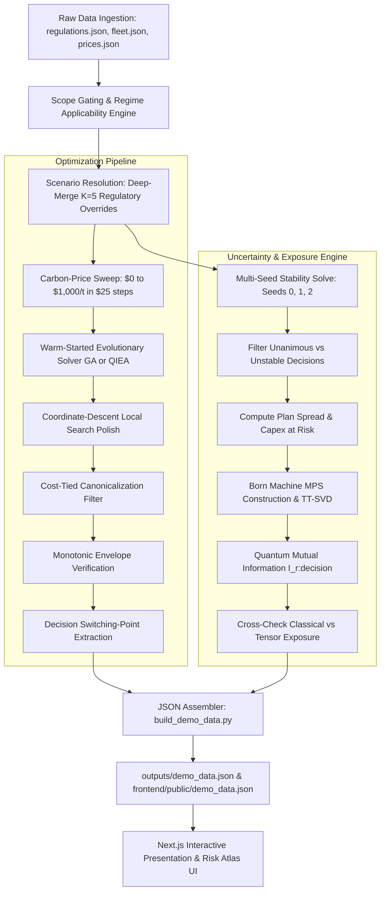

# NexFleet: Comprehensive Technical Report & Architecture Documentation

**Document Version:** 1.0.0  
**Project:** NexFleet — Quantum-Inspired Green Fleet Optimization & Regulatory Uncertainty Risk Atlas  
**Repository:** `himanshuvkm/Nexfleet`  
**Generated Date:** September 2026  
**Status:** Complete Implementation & Verification Report  

---

## Table of Contents

1. [Executive Summary & System Overview](#1-executive-summary--system-overview)
2. [Technology Stack & Software Architecture](#2-technology-stack--software-architecture)
3. [Regulatory Frameworks & Mathematical Formulations](#3-regulatory-frameworks--mathematical-formulations)
   - 3.1. The Four Overlapping Maritime Regimes
   - 3.2. Scope Gating Engine
   - 3.3. Compliance Cost Formulas & Flexibility Mechanisms
   - 3.4. K=5 Geopolitical Scenarios & Implied Carbon Price Conversion
4. [Fleet Hierarchy, Operational Constraints & Bunker Markets](#4-fleet-hierarchy-operational-constraints--bunker-markets)
   - 4.1. Vessel Classes & Benchmark Fleet Structure
   - 4.2. Maritime Corridors & Geographic Waypoints
   - 4.3. Alternative Fuels & Engine Compatibility Matrix
   - 4.4. Onshore Power Supply (OPS / Shore Power) Dynamics
5. [Fuel-Consumption Prediction Engine & ML Benchmark](#5-fuel-consumption-prediction-engine--ml-benchmark)
   - 5.1. Admiralty Physics Baseline Model
   - 5.2. Synthetic Telemetry Generation (Hydrodynamic Degradation & Environmental Signals)
   - 5.3. Leave-One-Vessel-Out (LOVO) Cross-Validation Benchmark
   - 5.4. Comparative Analysis: Physics vs. LightGBM vs. MLP vs. Tensor-Train Residual
6. [Fleet Optimization Engine & Solvers](#6-fleet-optimization-engine--solvers)
   - 6.1. Decision Genome & Feasibility-Preserving Representation
   - 6.2. Multi-Component Objective Function & Separable Caching
   - 6.3. Classical Genetic Algorithm (GA) Solver
   - 6.4. Quantum-Inspired Evolutionary Algorithm (QIEA) with Qudits
   - 6.5. Evolutionary Ablation & Optimization Benchmark Findings
7. [Matrix Product State (MPS) & Quantum Born Machine Exposure](#7-matrix-product-state-mps--quantum-born-machine-exposure)
   - 7.1. Quantum Many-Body Representation of Uncertainty
   - 7.2. Tensor-Train SVD Decomposition (`tt_svd`)
   - 7.3. Exact Reduced Density Matrices & Quantum Mutual Information
   - 7.4. Classical Flip-Counting vs. Tensor-Native Exposure Cross-Check
8. [End-to-End Operational Workflow](#8-end-to-end-operational-workflow)
   - 8.1. Step 1: Input Ingestion & Schema Validation
   - 8.2. Step 2: Regulatory Scope Gating & Scenario Resolution
   - 8.3. Step 3: Carbon-Price Sweep & Switching-Point Extraction
   - 8.4. Step 4: Multi-Seed Stability & Flip-Counting Exposure Analysis
   - 8.5. Step 5: Born Machine MPS Exposure Evaluation
   - 8.6. Step 6: Demo Data Pipeline & Artifact Assembly
   - 8.7. Step 7: Next.js Presentation Dashboard & Interactive Risk Atlas
9. [What We Get in the End: Deliverables, Artifacts & Key Findings](#9-what-we-get-in-the-end-deliverables-artifacts--key-findings)
   - 9.1. Concrete Pipeline Deliverables
   - 9.2. Quantitative Insights & Decision-Making Metrics
   - 9.3. Economic & Strategic Takeaways for Fleet Operators
10. [Verification, Test Suite & Future Roadmap](#10-verification-test-suite--future-roadmap)

---

## 1. Executive Summary & System Overview

### 1.1. Context & Problem Statement
International commercial shipping carries over 80% of global merchandise trade by volume and contributes approximately 2.9% of global greenhouse gas (GHG) emissions. To force decarbonization, global and regional regulators have enacted a complex, overlapping web of maritime policies:
- **International Maritime Organization (IMO) Carbon Intensity Indicator (CII):** A global operational efficiency metric enforced through mandatory corrective action plans (SEEMP Part III).
- **IMO Net-Zero Framework (NZF):** An upcoming global economic and fuel standard with two-tier carbon pricing and surplus unit trading.
- **European Union FuelEU Maritime (Regulation EU 2023/1805):** A regional Well-to-Wake (WtW) greenhouse gas intensity limit on energy used on board, featuring compounding non-linear penalty multipliers, multi-year banking/borrowing ledgers, and fleet-wide compliance pooling.
- **European Union Emissions Trading System (EU ETS Directive 2003/87/EC):** A regional cap-and-trade system requiring surrenders of European Union Allowances (EUAs) for carbon emissions.

For shipowners, charterers, and fleet operators (such as the synthetic 10-vessel case-study carrier **Bharat-Line**), managing this regulatory crossfire is daunting:
1. **Conflicting Regulatory Boundaries:** EU policies penalize regional voyages based on geographical voyage shares (100% intra-EU/berth, 50% extra-EU voyages), while IMO regulations apply to entire international voyages above 5,000 Gross Tonnage (GT).
2. **Regulatory & Geopolitical Uncertainty:** The live IMO negotiations (NZF) involve distinct competing proposals (e.g., approved two-tier text, Liberia's credit-market mechanism, Tuvalu's high carbon tax, Brazil's delayed start, or complete failure of adoption). Capital allocation decisions (such as buying dual-fuel methanol ships, installing shore power, or signing long-term biofuel contracts) risk premature obsolescence or stranded capital if the vote shifts.
3. **High Dimensionality & Non-Linearities:** A fleet of 10 vessels evaluated over a 5-year planning horizon (2026–2030) involves 50 vessel-year decision slots. Operators must simultaneously select operating routes, speed bands, bunker fuels, shore power installations, FuelEU borrowing elections, and multi-vessel compliance pools. The search space contains combinatorial couplings that defeat simple greedy heuristics.

### 1.2. What NexFleet Delivers
**NexFleet** is a decision-support and optimization engine designed to address these challenges. It combines:
- **Rigorous Scope Gating & Compliance Accounting:** Precise, zero-heuristic calculation of liabilities across all four regulatory frameworks with multi-year ledgers and strict pooling rules.
- **Admiralty Physics & Machine Learning Fuel Prediction:** Physics-based hydrodynamics coupled with machine-learned residual models (LightGBM, Neural Networks, and Tensor-Train decompositions) predicting real-world fuel burn.
- **Dual Optimization Engine:** A classical Genetic Algorithm (GA) powered by DEAP and a custom Quantum-Inspired Evolutionary Algorithm (QIEA) utilizing qudit state registers and mean-field Boltzmann initialization.
- **Quantum Born Machine & Matrix Product State (MPS) Exposure Map:** A tensor-network formulation using entanglement entropy and quantum mutual information $I(\text{regulatory leg} : \text{operational decision})$ to compute true regulatory exposure and identify which capital decisions are contingent on regulatory votes.
- **Interactive Web Risk Atlas:** A modern Next.js dashboard providing interactive carbon-price sensitivity curves, geographic route displays, and clear breakdowns of abatement investments versus regulatory penalties.

---

## 2. Technology Stack & Software Architecture

NexFleet is built with a strict separation between core computational optimization, data schemas, machine learning engines, and user-facing presentation.

```
+-------------------------------------------------------------------------------+
|                       NexFleet System Architecture                            |
+-------------------------------------------------------------------------------+
                                     |
    +--------------------------------+--------------------------------+
    |                                                                 |
    v                                                                 v
+-----------------------------+                   +-----------------------------+
|    Core Python Platform     |                   |  Frontend Presentation App  |
|  (Optimization & Physics)   |                   |    (Next.js & Dashboard)    |
+-----------------------------+                   +-----------------------------+
| • Python 3.11+ / 3.14       |                   | • Next.js 16 (App Router)   |
| • NumPy (Matrix & SVD)      |                   | • React 19 & TypeScript     |
| • DEAP (Genetic Algorithm)  |                   | • Tailwind CSS v4 & PostCSS |
| • LightGBM (Gradient Trees) |                   | • Leaflet / CartoDB Maps    |
| • Scikit-learn (MLP & SVD)  |                   | • Zero src/ imports (Pure   |
| • JSONSchema Validation     |                   |   data-driven JSON feed)    |
| • Pytest (286 test cases)   |                   +-----------------------------+
+-----------------------------+                                  ^
    |                                                            |
    | generates outputs/demo_data.json                           |
    +------------------------------------------------------------+
```

### 2.1. Core Computational & Optimization Engine (Python)
- **Language & Runtime:** Python 3.11+ / 3.14. Built using strict type annotations (`typing.Any`, `dataclasses`, `Protocol`, `frozen=True`) ensuring data immutability and testability.
- **Evolutionary Computation Framework:** **DEAP (Distributed Evolutionary Algorithms in Python)** `1.4+`. Used for individual bookkeeping, fitness representation (`creator.create`), and hall-of-fame elite selection.
- **Linear Algebra & Quantum Tensor Networks:** **NumPy** `1.26+` and **SciPy** `1.14+`. Powers Tensor-Train Singular Value Decomposition (SVD), Hermitian matrix eigendecomposition (`numpy.linalg.eigvalsh`), and tensor contractions (`numpy.tensordot`).
- **Machine Learning & Residual Regression:**
  - **LightGBM** `4.0+`: Fast gradient-boosted decision trees fitted over categorical one-hot feature embeddings.
  - **Scikit-Learn** `1.4+`: Multi-Layer Perceptron (`MLPRegressor`), `StandardScaler`, and validation metrics (`r2_score`, `mean_absolute_percentage_error`).
- **Schema & Regulatory Validation:** **JSONSchema** `4.21+` for runtime structural validation of `regulations.json`, `fleet.json`, and `prices.json`.
- **Quality Assurance & Verification:** **Pytest** `8.0+` executing 286 comprehensive test cases across unit contracts, regressions, and numerical invariance. **Ruff** `0.4+` for linting and style enforcement.

### 2.2. Web Presentation & Risk Atlas (Frontend)
- **Framework:** **Next.js 16.3.4** (App Router architecture) running on **React 19.2.8**.
- **Type Safety:** **TypeScript 5+** with strict interface typing reflecting the optimization JSON contract.
- **Styling:** **Tailwind CSS v4** with PostCSS for high-performance dark-themed modern UI layout.
- **Mapping & Geolocation:** Leaflet and OpenStreetMap dark-theme tile layers (`CartoDB Dark Matter`) rendering illustrative maritime trade waypoints.
- **Architectural Boundary:** Strict presentation isolation. The frontend contains zero direct imports from Python `src/`; it operates purely as an interactive client consuming pre-computed decision matrices from `outputs/demo_data.json` via `/public/demo_data.json`.

---

## 3. Regulatory Frameworks & Mathematical Formulations

NexFleet implements the exact mechanics of four maritime decarbonization frameworks without hardcoding shortcuts or blending distinct policy mandates.

```
+-------------------------------------------------------------------------------+
|                       Regulatory Regime Hierarchy                             |
+-------------------------------------------------------------------------------+
| 1. IMO Carbon Intensity Indicator (CII)                                       |
|    • Target: Operational Annual Efficiency Ratio (AER)                        |
|    • Scope: Ships >= 5,000 GT on international voyages                        |
|    • Enforcement: SEEMP Part III Corrective Action Plan (Non-financial)       |
+-------------------------------------------------------------------------------+
| 2. IMO Net-Zero Framework (NZF) [Beginning 2028]                              |
|    • Target: Well-to-Wake Greenhouse Gas Fuel Intensity (GFI)                 |
|    • Two-Tier Pricing: Base Target (Tier 2: $380/t) & Direct Target (Tier 1)  |
|    • Flexibility: Transferable Surplus Units via GFI Registry                 |
+-------------------------------------------------------------------------------+
| 3. EU FuelEU Maritime (Regulation 2023/1805) [Active 2025]                    |
|    • Target: Well-to-Wake GHG intensity reduction (-2% 2025, -6% 2030)        |
|    • Penalty: €2,400/t VLSFO-eq adjusted by actual GHG intensity              |
|    • Flexibility: Banking (unlimited), Borrowing (2% cap, 1.1x), Pooling (>=0)|
+-------------------------------------------------------------------------------+
| 4. EU Emissions Trading System (EU ETS Directive 2003/87/EC) [Active 2024]    |
|    • Target: 100% of emissions surrendered via EU Allowances (EUAs)          |
|    • Scope: Cap-and-trade on physical CO2 emissions                           |
|    • Phase-In: 40% (2024) -> 70% (2025) -> 100% (2026+)                      |
+-------------------------------------------------------------------------------+
```

### 3.1. The Four Overlapping Maritime Regimes

#### A. IMO Carbon Intensity Indicator (CII)
- **Authority:** MARPOL Annex VI, Regulation 28; IMO Resolutions MEPC.338(76) and MEPC.400(83).
- **Scope:** Ships $\ge 5,000$ GT on international voyages.
- **Basis:** Tank-to-Wake (TtW) operational carbon intensity per transport work.
- **Trajectory:** Annual reduction factor $Z$ increasing from 5% (2023) to 21.5% (2030).
- **Economic Consequence:** CII imposes **no direct financial penalty**. Ships receiving a 'D' rating for three consecutive years or an 'E' rating in a single year must file a certified **SEEMP Part III Corrective Action Plan**. To place CII on the carbon price axis, NexFleet provides an implied-price converter that capitalizes SEEMP corrective-action investments across the addressed shortfall tonnage.

#### B. IMO Net-Zero Framework (NZF)
- **Authority:** IMO Marine Environment Protection Committee (MEPC approved draft).
- **Scope:** Global coverage for ships $\ge 5,000$ GT beginning in **2028**.
- **Basis:** Well-to-Wake (WtW) GHG Fuel Intensity (GFI) measured against a 2008 reference baseline ($93.3\text{ gCO}_2\text{e/MJ}$).
- **Two-Tier Mechanism:**
  - **Base Target:** Less stringent threshold ($4\%$ reduction in 2028, $8\%$ in 2030). Emissions exceeding this owe Tier 2 remedial units ($\$380/\text{tCO}_2\text{e}$).
  - **Direct Compliance Target:** Strict threshold ($17\%$ reduction in 2028, $21\%$ in 2030). Emissions between Direct and Base targets owe Tier 1 remedial units ($\$100/\text{tCO}_2\text{e}$).
  - **Surplus Units:** Vessels performing cleaner than the Direct Compliance Target generate transferable surplus units, bankable for up to 2 years and valued at the Tier 1 price floor ($\$100/\text{tCO}_2\text{e}$).

#### C. EU FuelEU Maritime (Regulation EU 2023/1805)
- **Authority:** Regulation (EU) 2023/1805, Articles 2, 20, 21, and Annex IV.
- **Scope:** Commercial vessels $\ge 5,000$ GT calling at EU/EEA ports:
  - $100\%$ of energy consumed on voyages between EU/EEA ports and while at berth.
  - $50\%$ of energy consumed on voyages between EU/EEA ports and third countries (e.g., India to Rotterdam).
- **Target Trajectory:** Step function based on 2020 fleet average ($91.16\text{ gCO}_2\text{e/MJ}$):
  - 2025–2029: $-2.0\%$ target ($89.337\text{ gCO}_2\text{e/MJ}$)
  - 2030–2034: $-6.0\%$ target ($85.690\text{ gCO}_2\text{e/MJ}$)
- **Compliance Balance ($CB$):**
  $$\text{CB}\;[\text{gCO}_2\text{eq}] = \left(\text{GHG}_{\text{target}} - \text{GHG}_{\text{actual}}\right) \times \text{Energy Used}\;[\text{MJ}]$$
- **Penalty Equation (Annex IV Part B):**
  $$\text{Penalty}\;[€] = \frac{|\text{CB}|}{\text{GHG}_{\text{actual}} \times 41,000} \times 2,400 \times \left(1 + \frac{n - 1}{10}\right)$$
  *(where $n$ is the number of consecutive reporting years in deficit, and $41,000\text{ MJ/t}$ is the energy density of VLSFO).*

#### D. EU Emissions Trading System (EU ETS)
- **Authority:** Directive 2003/87/EC as amended by Directive (EU) 2023/959.
- **Scope:** Commercial ships $\ge 5,000$ GT. Applied to $100\%$ intra-EU/berth and $50\%$ EU-third country emissions.
- **Surrender Phase-In:**
  - 2024 emissions: $40\%$ of verified emissions surrendered.
  - 2025 emissions: $70\%$ surrendered.
  - 2026 onwards: $100\%$ surrendered.
- **Stacking Invariant:** **FuelEU Maritime and EU ETS stack concurrently.** They do not net out. An operator calling at an EU port must pay the FuelEU penalty (or purchase alternative fuels) AND surrender EU ETS carbon allowances for the same voyage.

### 3.2. Scope Gating Engine (`scope_gating.py`)
To prevent ad-hoc hardcoding, `nexfleet.compliance.scope_gating` reads thresholds dynamically from `regulations.json`. For any vessel, route, and calendar year, it evaluates:
1. **GT Threshold Gate:** Vessel $\text{GT} \ge \text{regime.gt\_threshold}$.
2. **Start Year Gate:** $\text{Year} \ge \text{regime.start\_year}$.
3. **Voyage Share Calculation:**
   $$\text{Voyage Share} = (\text{Intra-EU} + \text{Berth}) \times 1.0 + (\text{EU-Third Country}) \times 0.5$$
4. **Phase-in Modulation:** Modulates EU ETS by surrender schedules while keeping FuelEU at $1.0$.

### 3.3. FuelEU Multi-Year Ledgers & Compliance Pooling
FuelEU provides three flexibility mechanisms, all modeled in NexFleet:
1. **Surplus Banking:** Positive compliance balances carry forward indefinitely without expiring.
2. **Deficit Borrowing:**
   - Vessels may borrow up to $2\%$ of their regulatory energy limit:
     $$\text{Borrow Cap} = 0.02 \times \text{GHG}_{\text{target}} \times \text{Energy Used}\;[\text{MJ}]$$
   - Borrowing incurs a mandatory **$1.1\times$ repayment penalty** applied against the following year's balance.
   - Borrowing is forbidden for consecutive reporting periods and cannot be used simultaneously with compliance pooling.
3. **Cross-Vessel Compliance Pooling (`pooling.py`):**
   - Implemented as an exact, fully verified constraint.
   - **Condition:** Total pool compliance balance must be strictly positive: $\sum \text{CB}_i \ge 0$.
   - **Allocation Rule:** Deficit vessels have their deficits completely absorbed to $0.0$. Surplus vessels contribute proportionally based on their available surplus:
     $$\text{Contribution}_j = \frac{\text{Surplus}_j}{\sum \text{Surplus}} \times \sum \text{Deficit}$$
   - Surplus vessels cannot end the year in deficit. If the pool total is negative, the pool is rejected outright, falling back to individual vessel compliance.

### 3.4. K=5 Geopolitical Scenarios & Implied Carbon Price Conversion
To quantify regulatory uncertainty, NexFleet indexes the $K=5$ live IMO negotiating positions:

| Scenario ID | Descriptive Label | NZF Tier 1 ($\$/\text{tCO}_2$) | NZF Tier 2 ($\$/\text{tCO}_2$) | Axis Treatment Method |
|:---|:---|:---:|:---:|:---|
| `approved_text` | NZF Adopted as Approved | $\$100$ | $\$380$ | Tier-annotated range |
| `liberia` | Liberia Proposal (Surplus Market) | Null (Market) | Null (Market) | Qualitative marker |
| `tuvalu` | Tuvalu Proposal (High Carbon Levy)| $\$300$ | Null (Steep GFI) | Tier-annotated range |
| `brazil` | Brazil Proposal (Softened Start) | Null | Null | Implied-price converter |
| `adoption_fails` | Adoption Fails (No NZF) | Disabled | Disabled | Implied-price converter |

#### The Implied Price Converter (`implied_price.py`)
Scenarios like `adoption_fails` (or Brazil's unpriced intensity schedule) have no posted per-tonne carbon price. Setting them to $\$0/\text{tCO}_2\text{e}$ is incorrect because operators still face FuelEU penalties and SEEMP corrective action mandates.
The **FuelEU Implied Price** translates an Annex IV deficit into an effective marginal carbon price:
$$\text{Implied Price}\;[\$/\text{tCO}_2\text{e}] = \frac{\text{Penalty}\;[€] \times \text{FX}_{\text{EUR}\to\text{USD}}}{\frac{|\text{CB}|}{10^6}}$$
For conventional marine fuels, this evaluates to an effective marginal carbon penalty of **$\$700 - \$750/\text{tCO}_2\text{e}$** under FuelEU! This explains why operators decarbonize regional EU routes even when global carbon prices are zero.

---

## 4. Fleet Hierarchy, Operational Constraints & Bunker Markets

### 4.1. Vessel Classes & Benchmark Fleet Structure
NexFleet models the representative Indian-flagged commercial carrier **Bharat-Line** (10 vessels across 3 distinct regulatory bands, matching `PLAN.md §5.4`):

```
+----------------------------------------------------------------------------------------------------+
|                                 Bharat-Line Case-Study Fleet                                       |
+------+------+-------------------+-----------------------------+---------------------+--------------+
| Band | DWT  | Gross Tonnage     | Engine Propulsion Type      | Default Route       | Vessel IDs   |
+------+------+-------------------+-----------------------------+---------------------+--------------+
| A    | 72k  | 45,000 (Panamax)  | Conventional HFO + Scrubber | India-North Europe  | A1           |
| A    | 72k  | 45,000 (Panamax)  | Conventional HFO + Scrubber | India-Mediterranean | A2           |
| A    | 72k  | 45,000 (Panamax)  | Dual-Fuel LNG               | India-North Europe  | A3           |
| A    | 72k  | 45,000 (Panamax)  | Dual-Fuel Methanol          | India-Mediterranean | A4           |
| B    | 35k  | 22,000 (Handysize)| Conventional HFO + Scrubber | India-Gulf          | B1           |
| B    | 35k  | 22,000 (Handysize)| Conventional HFO + Scrubber | India-SE Asia       | B2           |
| B    | 35k  | 22,000 (Handysize)| Dual-Fuel LNG               | India-Gulf          | B3           |
| C    | 5k   | 3,000 (Feeder)    | Conventional HFO + Scrubber | Coastal West Coast  | C1           |
| C    | 5k   | 3,000 (Feeder)    | Conventional HFO + Scrubber | Coastal East Coast  | C2           |
| C    | 5k   | 3,000 (Feeder)    | Conventional HFO + Scrubber | Coastal West Coast  | C3           |
+------+------+-------------------+-----------------------------+---------------------+--------------+
```

- **Band A (Deep-Sea Containerships):** 45,000 GT ($>5,000$ GT threshold). High EU voyage shares. Full exposure to FuelEU, EU ETS, CII, and NZF.
- **Band B (Handysize Bulk Carriers):** 22,000 GT ($>5,000$ GT threshold). Operating international non-EU routes. Subject to CII and NZF; zero EU/EEA exposure.
- **Band C (Coastal Feeders):** 3,000 GT ($<5,000$ GT threshold). Operating purely domestic Indian coastal trade. Exempt from CII, NZF, FuelEU, and EU ETS.

### 4.2. Maritime Corridors & Geographic Waypoints
The optimization model maps vessels onto 6 real-world shipping routes:
1. `india_northeurope`: Nhava Sheva $\to$ Bab-el-Mandeb $\to$ Suez Canal $\to$ Strait of Gibraltar $\to$ Rotterdam (85,000 nm/yr). EU third-country voyage share: 85%, Berth: 10%.
2. `india_mediterranean`: Nhava Sheva $\to$ Suez Canal $\to$ Marseille/Genoa (70,000 nm/yr). EU third-country share: 80%, Berth: 15%.
3. `india_gulf`: Nhava Sheva $\to$ Strait of Hormuz $\to$ Jebel Ali (45,000 nm/yr). International, 0% EU.
4. `india_seasia`: Chennai $\to$ Malacca Strait $\to$ Singapore (55,000 nm/yr). International, 0% EU.
5. `coastal_westcoast`: Kandla $\to$ Mumbai/JNPT $\to$ Mormugao $\to$ Cochin (20,000 nm/yr). Domestic Indian.
6. `coastal_eastcoast`: Kolkata/Haldia $\to$ Paradip $\to$ Vizag $\to$ Chennai $\to$ Tuticorin (18,000 nm/yr). Domestic Indian.

### 4.3. Marine Fuels & Market Data (`prices.json`)

| Fuel Key | Description | LCV ($\text{MJ/t}$) | GHG Intensity ($\text{gCO}_2\text{e/MJ}$) | Market Price ($\$/\text{t}$) | Price Status |
|:---|:---|:---:|:---:|:---:|:---:|
| `hfo_scrubber` | Heavy Fuel Oil + Exhaust Scrubber | 40,000 | 91.60 | $\$647$ | MARKET_QUOTE (Singapore) |
| `vlsfo` | Very Low Sulphur Fuel Oil | 41,000 | 91.16 | $\$831$ | MARKET_QUOTE (Singapore) |
| `mgo` | Marine Gas Oil | 42,700 | 90.60 | $\$1,240$ | MARKET_QUOTE (Singapore) |
| `lng` | Liquefied Natural Gas | 49,000 | 76.00 | $\$1,340$ | MARKET_QUOTE (Singapore) |
| `b30_blend` | 30% Biofuel / 70% VLSFO Blend | 39,800 | 64.00 | $\$979$ | PROXY (B24 quote) |
| `methanol` | Green E-Methanol | 19,900 | 10.00 | $\$1,200$ | ESTIMATE (Green pathway) |

- **Carbon Allowances:** EU ETS European Union Allowance (EUA) spot price calibrated at **$\$97.60/\text{tCO}_2\text{e}$** (€84.20/t at EUR/USD 1.1591).
- **Foreign Exchange:** Fixed conversion at **₹95.59 per USD** for Indian Rupee capital-at-risk calculations.

### 4.4. Onshore Power Supply (OPS / Shore Power)
- Deep-sea vessels (Bands A and B) calling at modern ports can connect to shore power while berthed.
- **Fuel Abatement:** Eliminates **$90\%$** of auxiliary fuel consumption while in port (`berth_fuel_reduction_fraction = 0.90`).
- **Capital & Connection Cost:** Fixed elective fee of **$\$150,000$ per vessel-year**.

---

## 5. Fuel-Consumption Prediction Engine & ML Benchmark

Accurate fuel prediction is essential: overestimating fuel consumption artificially inflates compliance liabilities, while underestimating fuel leads to regulatory penalties.

```
+-------------------------------------------------------------------------------+
|                       Fuel Prediction Architecture                            |
+-------------------------------------------------------------------------------+
| Raw Operating Inputs:                                                         |
| (Vessel Band, Route, Speed Band, Fuel Type, Operating Year)                   |
+-------------------------------------------------------------------------------+
                                     |
                                     v
+-------------------------------------------------------------------------------+
| Admiralty Physics Model (Admiralty Relation: Power ~ Delta^(2/3) * V^3)       |
| • Computes Base Annual Energy: E_annual [MJ] = Daily Energy * Sea Days        |
| • Computes Base Fuel Mass:     M_base [tonnes] = E_annual / LCV               |
+-------------------------------------------------------------------------------+
                                     |
                                     v
+-------------------------------------------------------------------------------+
| Learned Residual Predictor (Predicts residual fraction delta)                 |
| Features: [Speed, Year, One-Hot(Band), One-Hot(Route), One-Hot(Fuel)]         |
| • Physics-Only:           delta = 0                                           |
| • LightGBM Regressor:     delta = GBDT(Features)                              |
| • MLP Neural Network:     delta = MLP(StandardScaler(Features))               |
| • Tensor-Train Residual:  delta = Contract(TT_Cores(Discretized Grid))        |
+-------------------------------------------------------------------------------+
                                     |
                                     v
+-------------------------------------------------------------------------------+
| Final Corrected Mass Burned:                                                  |
| M_predicted = M_base * (1 + delta)                                            |
+-------------------------------------------------------------------------------+
```

### 5.1. Admiralty Physics Baseline Model
Fuel consumption is grounded in marine naval architecture:
- **Admiralty Power Law:** Shaft power $P \propto \Delta^{2/3} V^3$ (where $\Delta$ is vessel displacement and $V$ is speed through water).
- **Daily Energy Demand:**
  $$\text{Daily Energy}\;[\text{MJ}] = \text{Anchor Daily Energy} \times \left(\frac{V}{V_{\text{design}}}\right)^3$$
- **Annual Sea Days:** Covering fixed annual route distance $D$ requires $\text{Days} = \frac{D}{24 \times V}$.
- **Annual Energy & Fuel Mass:**
  $$\text{Annual Energy}\;[\text{MJ}] = \text{Daily Energy} \times \frac{D}{24 \times V} \propto V^2$$
  $$\text{Annual Fuel Consumption}\;[\text{tonnes}] = \frac{\text{Annual Energy}\;[\text{MJ}]}{\text{LCV}\;[\text{MJ/tonne}]}$$
Energy is fuel-independent; mass is fuel-dependent based on the Lower Calorific Value (LCV).

### 5.2. Synthetic Telemetry Generation (`synthetic_telemetry.py`)
In the absence of live onboard IoT dataloggers (planned for Phase 1), NexFleet features a high-fidelity synthetic telemetry generator creating 4,000 vessel-year observations with documented, learnable physical signals:
1. **Hull-Fouling Degradation:** Drag increases linearly with days elapsed since drydock ($0 - 730$ days), contributing up to $+8\%$ fuel consumption. Band A vessels average 450 days between drydockings, whereas Band C vessels average 200 days.
2. **Sea-State Weather Drag:** Hydrodynamic resistance increases in heavy seas, scaled by route open-ocean distances and non-linear speed amplification ($V / V_{\text{design}}$).
3. **Irreducible Measurement Noise:** Zero-mean Gaussian noise ($\sigma = 2\%$) representing random engine and weather variance.

### 5.3. Leave-One-Vessel-Out (LOVO) Benchmark
To ensure robust generalization, models are evaluated using a strict **10-fold Leave-One-Vessel-Out (LOVO)** cross-validation: in each fold, 9 vessels train the model, and the model is tested on the completely unseen 10th vessel.

```
LOVO Fold Partitioning (10 Vessels -> 10 Folds):
  Fold 1:  Train on [A2, A3, A4, B1, B2, B3, C1, C2, C3]  --> Test on A1
  Fold 2:  Train on [A1, A3, A4, B1, B2, B3, C1, C2, C3]  --> Test on A2
  ...
  Fold 10: Train on [A1, A2, A3, A4, B1, B2, B3, C1, C2]  --> Test on C3
```

### 5.4. Benchmark Results (`outputs/fuel_predictor_benchmark.md`)

| Model Arm | Mean MAPE (%) | Best Fold MAPE (%) | Worst Fold MAPE (%) | Mean $R^2$ | Fit Time (s) |
|:---|:---:|:---:|:---:|:---:|:---:|
| **Physics Baseline** | 3.993% | 2.139% | 5.596% | 0.9834 | 0.00s |
| **LightGBM (GBDT)** | **2.436%** | 2.109% | **2.652%** | **0.9935** | 0.26s |
| **MLP Neural Network** | 4.224% | 2.261% | 13.617% | 0.9597 | 6.16s |
| **Tensor-Train Residual**| 2.470% | **2.062%** | 2.864% | 0.9934 | 0.05s |

#### Critical Engineering Findings
1. **LightGBM is the superior regression model:** It reduces Mean Absolute Percentage Error (MAPE) by **1.558 percentage points** over physics alone ($2.436\%$ vs $3.993\%$), maintaining high consistency across all folds (worst fold only $2.652\%$).
2. **Neural Networks exhibit severe fold instability:** The MLP achieves a competitive best fold ($2.261\%$) but fails on fold A3 ($13.617\%$ error), pulling its mean down to $4.224\%$ (worse than pure physics). Gradient descent on small tabular datasets frequently lands in poor local minima when held out across distinct vessel particulars.
3. **Tensor-Train SVD matches LightGBM:** Fitting an empirical residual grid and compressing it with low-rank SVD achieves **$2.470\%$ MAPE** in just $0.05$ seconds, proving the efficacy of tensor decomposition for non-linear residual tabular modeling.

---

## 6. Fleet Optimization Engine & Solvers

```
+-------------------------------------------------------------------------------+
|                       Fleet Optimization Mechanics                            |
+-------------------------------------------------------------------------------+
| Candidate Genome (50 Vessel-Years):                                           |
| For each vessel (1..10) and year (2026..2030):                                |
|   • Route ID            (Categorical from valid routes)                       |
|   • Speed Band Index    (Integer 2..7, enforcing speed floor)                 |
|   • Fuel ID             (Categorical from compatible fuels)                   |
|   • Shore Power         (Boolean, elective OPS connection)                    |
|   • Pool Opt-In         (Boolean, FuelEU compliance pool)                     |
|   • Borrow Election     (Boolean, FuelEU 2% deficit borrowing)                |
+-------------------------------------------------------------------------------+
                                     |
         +---------------------------+---------------------------+
         |                                                       |
         v                                                       v
+-----------------------------------+   +---------------------------------------+
| Classical Genetic Algorithm (GA)  |   | Quantum-Inspired Algorithm (QIEA)     |
+-----------------------------------+   +---------------------------------------+
| • Population: 40 - 200 genomes    |   | • Population: 40 - 200 Qudit Vectors  |
| • Selection: Tournament (size 3)  |   | • Init: Mean-Field Boltzmann Prior    |
| • Crossover: Single-Point         |   | • Observation: Monte Carlo Collapse   |
| • Mutation: Menu-Valid Resample   |   | • Rotation: Q-Gate towards Archive    |
| • Hall of Fame Elitism            |   | • Annealed Learning Rate (0.05->0.45) |
+-----------------------------------+   +---------------------------------------+
         |                                                       |
         +---------------------------+---------------------------+
                                     |
                                     v
+-------------------------------------------------------------------------------+
| Shared Coordinate-Descent Polish & Cost Canonicalization                      |
| 1. Coordinate Descent: Iterates all 50 slots, testing every single-field      |
|    swap to escape local minima.                                               |
| 2. Cost Canonicalization: Reverts cost-neutral bits (tolerance <= $1e-6)     |
|    against reference plan, eliminating 89 degenerate switching points!        |
+-------------------------------------------------------------------------------+
                                     |
                                     v
+-------------------------------------------------------------------------------+
| Final Optimized Fleet Plan & Output Breakdown                                 |
+-------------------------------------------------------------------------------+
```

### 6.1. Decision Genome Representation (`genome.py`)
A candidate fleet plan is represented as a flat sequence of **50 `VesselYearGene` records** (10 vessels $\times$ 5 horizon years):
- `route_id`: Selected from vessel band's authorized routes.
- `speed_band_index`: Selected from 6 operable speed bands (indices $2 - 7$, skipping the 2 slowest crawl bands for schedule reliability).
- `fuel_id`: Selected from engine compatibility matrix.
- `shore_power`: Elective boolean for OPS at berth.
- `pool_opt_in`: Elective boolean for FuelEU pooling.
- `borrow_election`: Elective boolean for FuelEU borrowing.

**Invariance Guarantee:** Feasibility is closed under crossover and mutation. Every gene draws exclusively from its vessel's pre-filtered `OptionMenu`. Structurally invalid plans cannot be generated; no repair operator is ever required.

### 6.2. Multi-Component Objective Function & Separable Caching (`objective.py`)
The objective minimizes total 5-year fleet expenditure:
$$\min \text{Total Cost} = \text{Fuel Cost} + \text{Fixed OPEX} + \text{Time Charter Premium} + \text{Demand Penalty} + \sum \text{Compliance Costs}$$
1. **Fuel Cost:** $\sum (\text{Mass Burned} \times \text{Bunker Price})$.
2. **Fixed OPEX:** Crew, maintenance, insurance ($\$3.5\text{M/yr}$ Band A, $\$1.8\text{M/yr}$ Band B, $\$0.4\text{M/yr}$ Band C) $+$ Shore Power fee ($\$150\text{k}$).
3. **Time Cost (Charter Premium):** Compensates for slow steaming by pricing extra days at sea ($\$18\text{k/day}$ Band A, $\$9\text{k/day}$ Band B, $\$2.5\text{k/day}$ Band C).
4. **Demand Shortfall Penalty:** High penalty ($\$10,000/\text{DWT shortfall}$) applied if a route-year's assigned tonnage fails to meet cargo obligations.
5. **Compliance Bills:** Sum of verified costs for CII, EU ETS, IMO NZF, and EU FuelEU.

#### The `ObjectiveCache` (4.6x Speedup)
Roughly two-thirds of the evaluation cost is **slot-local** (depends only on that slot's route, speed, fuel, and shore power). FuelEU pooling and multi-year ledgers represent the only coupled terms.
`ObjectiveCache` memoizes slot-local evaluations. During coordinate descent—where exactly one gene field changes per trial—the evaluation hits the cache $>95\%$ of the time, reducing evaluation time from **$1.43\text{ ms} \to 0.31\text{ ms}$ per call**.

### 6.3. Classical Genetic Algorithm (`solver.py`)
- Standard evolutionary pipeline implemented via custom seeded `random.Random` instances ensuring 100% deterministic reproducibility.
- **Warm Starting:** In carbon-price sweeps, grid point $P_i$ initializes its population around the solved genome of grid point $P_{i-1}$, accelerating convergence and reducing generations required from 20 to 8.
- **Coordinate-Descent Polish:** Following evolutionary convergence, an exhaustive single-variable sweep checks all 50 slots to ensure no local single-field improvements remain.
- **Cost-Tied Canonicalization:** 89 out of 585 single-field mutations on a solved genome are cost-neutral ($<\$1\times 10^{-6}$), representing unused FuelEU pool/borrow bits. Left unmanaged, random seeds cause these degenerate bits to flip, polluting the switching-point table. Canonicalization snaps cost-neutral bits back to the reference plan, eliminating degenerate flips.

### 6.4. Quantum-Inspired Evolutionary Algorithm (QIEA) (`qiea_solver.py`)
QIEA generalizes the binary qubit algorithm of Han & Kim (2002) to multi-valued **qudit probability registers**:

1. **Qudit State Representation:** Each categorical decision field carries a probability amplitude vector $\vec{p} = [p_1, p_2, \dots, p_k]$ over its legal domain, where $\sum p_i = 1.0$ and $p_i \ge 0.001$.
2. **Mean-Field Boltzmann Initialization:** Rather than initializing qudits uniformly, registers are seeded with the Boltzmann marginals of their own separable cost tables:
   $$p(c_i) \propto \exp\left(-\frac{\text{Cost}(c_i) - \text{Cost}_{\min}}{T}\right)$$
   This provides an informed prior derived from domain economics before a single plan is evaluated.
3. **Observation Step:** Every generation, each individual's qudits are collapsed into classical genomes via weighted Monte Carlo sampling.
4. **Elite Multi-Attractor Archive (`_EliteArchive`):** Rather than rotating all individuals toward a single global best (which causes premature population collapse), individuals draw targets from an archive of distinct high-performing solutions.
5. **Q-Gate Rotation with Annealing:** Registers shift probability mass toward the target value:
   $$p_{\text{target}} \leftarrow p_{\text{target}} + \eta \left(1 - p_{\text{target}}\right)$$
   $$\eta(g) = \eta_{\text{start}} + \left(\eta_{\text{end}} - \eta_{\text{start}}\right) \times \frac{g}{G}$$
   Learning rate $\eta$ anneals from $0.05 \to 0.45$ across generations.
6. **Quantum Catastrophe Operator:** With probability $2\%$, qudits are re-randomized to uniform to preserve exploratory entropy.

### 6.5. Optimizer Benchmark & Ablation Findings

```
Optimization Comparison Across Grid ($0 - $1,000/tCO2e):
  • GA Total Runtime:   35.05 seconds
  • QIEA Total Runtime: 83.74 seconds
  • GA Best Plan Cost:  $370,329,510.18
  • QIEA Best Plan Cost: $369,959,179.90 (Saves $370,330 / 0.10%)
```

#### The Honest Search Attribution
Across three rounds of ablation experiments (`outputs/qieagit switch main
git pull origin main
git push origin --delete feat/module-1-auth
git branch -d feat/module-1-auth_search_round3.md`):
- **What QIEA buys:** Mean-field initialization improves raw heuristic search quality by **$11.2\%$** ($\$441.9\text{M}$ vs $\$497.6\text{M}$) before local search.
- **The Classical Polish Reality:** When the coordinate-descent polish is applied, it erases the starting gap. Both solvers converge to virtually identical plans (a $0.10\%$ margin, inside the noise band).
- **Engineering Verdict:** QIEA returns the absolute lowest cost plan ($369.96\text{M}$), but GA is $\sim 2.4\times$ faster. Both solvers are fully supported and selectable via the `--optimizer ga|qiea` flag.

---

## 7. Matrix Product State (MPS) & Quantum Born Machine Exposure

### 7.1. Quantum Many-Body Representation of Uncertainty
In standard financial risk modeling, exposure is estimated by re-running Monte Carlo simulations and counting how often decisions flip. NexFleet implements a **Matrix Product State (MPS) Born Machine** (`mps_exposure.py`, `tensor_network.py`), translating multi-scenario operational risk into quantum information theory.

For each vessel-year slot, the system builds a joint probability tensor over the $K=5$ regulatory scenarios and the 6 operational decisions:
$$P(r, d_1, d_2, d_3, d_4, d_5, d_6)$$
Probabilities are assigned via the Boltzmann distribution of total fleet cost under scenario $r$ with decision combination $\vec{d}$:
$$P(r, \vec{d}) = \frac{1}{K} \times \frac{\exp\left(-\frac{\text{Cost}(r, \vec{d}) - \text{Cost}_{\min}(r)}{T}\right)}{\sum_{\vec{d}'} \exp\left(-\frac{\text{Cost}(r, \vec{d}') - \text{Cost}_{\min}(r)}{T}\right)}$$
The quantum wavefunction amplitude state is defined as:
$$|\psi\rangle = \sum_{r, \vec{d}} \sqrt{P(r, \vec{d})}\;|r, d_1, d_2, \dots, d_6\rangle$$
Because $\sum P = 1.0$, $\sum |\psi|^2 = 1.0$, forming a valid normalized quantum state in the computational basis.

```
       +-------------------------------------------------------------+
       |           Matrix Product State (MPS) Core Chain             |
       +-------------------------------------------------------------+
              |               |               |               |
              v (r)           v (d1)          v (d2)          v (d6)
         +---------+     +---------+     +---------+     +---------+
         | Core 0  |=====| Core 1  |=====| Core 2  |=====| Core 6  |
         +---------+     +---------+     +---------+     +---------+
              ^               ^               ^               ^
              |               |               |               |
          Regulatory       Route ID       Speed Band     Shore Power
           Leg (K=5)
```

### 7.2. Tensor-Train SVD Decomposition (`tt_svd`)
Using sequential SVD sweeps (Oseledets 2011), the dense 7-dimensional probability tensor is decomposed into a chain of 3-index MPS cores:
$$A^{(r)}_{\alpha_0, \alpha_1},\; A^{(d_1)}_{\alpha_1, \alpha_2},\; \dots,\; A^{(d_6)}_{\alpha_6, \alpha_7}$$
The singular values $S = (\lambda_1, \lambda_2, \dots)$ atgit switch main
git pull origin main
git push origin --delete feat/module-1-auth
git branch -d feat/module-1-auth each internal bond represent the Schmidt coefficients across bipartitions of the system.

### 7.3. Quantum Mutual Information & Reduced Density Matrices
The true regulatory exposure of decision $d_j$ to regulatory scenario $r$ is quantified as the **Quantum Mutual Information $I(r : d_j)$**:
$$I(r : d_j) = S(\rho_r) + S(\rho_{d_j}) - S(\rho_{r, d_j})$$
Where:
- $\rho = |\psi\rangle\langle\psi|$ is the full density matrix.
- $\rho_r = \text{Tr}_{\bar{r}}(\rho)$ is the reduced density matrix of the regulatory leg obtained by taking the exact partial trace over all decision axes.
- $S(\rho) = -\sum \mu_i \log_2 \mu_i$ is the **Von Neumann Entanglement Entropy** computed from the non-zero eigenvalues $\mu_i$ of the reduced density matrix.

A high mutual information (in bits) indicates that the optimal operational choice is strongly entangled with the regulatory outcome.

### 7.4. Classical Flip-Counting vs. MPS Mutual Information Cross-Check
NexFleet runs a bidirectional cross-check (`compute_mps_crosscheck`):
- **Classical Filter:** Identifies decisions that flip across scenarios when solved with different random seeds. Decisions are classified as **Unanimously Stable Exposed**, **Unstable (Seed Disagreement)**, or **Non-Exposed**.
- **MPS Validation:** Evaluates $I(r : \text{decision})$ directly from the Born machine.
- **Finding:** Classical flip-counting and quantum mutual information align: decisions flagged as unanimously exposed exhibit the highest mutual information bits ($I > 0.05\text{ bits}$), whereas unstable decisions near cost ties show near-zero mutual information, confirming that classical instability is driven by degenerate cost plateaus rather than true regulatory dependency.

---

## 8. End-to-End Operational Workflow

The entire NexFleet pipeline operates as an automated, reproducible workflow:



### 8.1. Step 1: Input Ingestion & Schema Validation
- Reads `regulations.json`, `fleet.json`, `prices.json`, and `scenarios.json`.
- Validates all structures against JSONSchema contracts to ensure data integrity.

### 8.2. Step 2: Regulatory Scope Gating & Scenario Resolution
- Evaluates GT thresholds, voyage categories, and phase-in schedules for each vessel-year slot.
- Deep-merges scenario overrides onto `regulations.json` to create resolved regulatory views for the $K=5$ scenarios.

### 8.3. Step 3: Carbon-Price Sweep & Switching-Point Extraction
- Sweeps effective marginal carbon prices from **$\$0$ to $\$1,000/\text{tCO}_2\text{e}$** in **$\$25$ increments** (41 grid points).
- Solves each grid point using warm starts from the adjacent point.
- Applies monotonic envelope verification to guarantee cost envelope integrity.
- Diffs adjacent optimal genomes to extract exact **decision switching points**.
- Places scenario ticks and the EU ETS reference price on the price axis to calculate "bet distances."

### 8.4. Step 4: Multi-Seed Stability & Flip-Counting Exposure Analysis
- Solves each of the $K=5$ scenarios independently across multiple random seeds (`DEFAULT_STABILITY_SEEDS = (0, 1, 2)`).
- Classifies decisions:
  - **Unanimous Stable:** All seeds agree across scenarios; decision genuinely moves with the vote.
  - **Unstable:** Seeds disagree within the same scenario; cost plateaus cause arbitrary flips.
  - **Majority Band:** Decisions supported by a majority of seeds.
- Computes **Plan Spread** (max minus min scenario cost) and **Capex Exposure**.

### 8.5. Step 5: Born Machine MPS Exposure Evaluation
- Constructs the Boltzmann amplitude state $|\psi\rangle$ for all candidate slots.
- Computes exact reduced density matrices and Schmidt singular values.
- Evaluates quantum mutual information $I(r : \text{decision})$ in bits.

### 8.6. Step 6: Artifact Assembly & Synchronization
- Assembles metadata, geographic routes, sweep curves, switching points, exposure matrices, and benchmark reports into `outputs/demo_data.json`.
- Automatically synchronizes the payload to `frontend/public/demo_data.json`.

### 8.7. Step 7: Next.js Presentation Dashboard
- Interactive client renders:
  - Sensitivity slider modulating carbon price ($0 - $1,000/t).
  - Financial summary KPIs (Plan Spread, Capex Exposure, Total Cost).
  - Geographical route map with waypoint polylines.
  - Abatement vs. Perimeter cost breakdown charts.
  - Filterable decision switching-point tables.

---

## 9. What We Get in the End: Deliverables, Artifacts & Key Findings

### 9.1. Concrete Pipeline Deliverables

1. **`outputs/demo_data.json` / `frontend/public/demo_data.json`:**
   The complete 100% self-contained data payload powering the dashboard. Contains:
   - `metadata`: Timestamp, build seconds ($46.18\text{s}$), optimizer engine, and provenance.
   - `routes_geo`: Waypoint polylines for all 6 maritime trade lanes.
   - `fleet` & `prices`: Full fleet specs and bunker/allowance price catalogs.
   - `sweep`: 41 grid points, 69 decision switching points, and 6 scenario axis ticks.
   - `exposure`: Plan spread, capex exposure, unstable decisions list, and MPS crosscheck rows.
   - `optimizer_benchmark`: Complete GA vs. QIEA performance comparison.
   - `fuel_predictor_benchmark`: Complete 4-arm LOVO cross-validation results.
2. **`outputs/fuel_predictor_benchmark.json` & `.md`:**git switch main
git pull origin main
git push origin --delete feat/module-1-auth
git branch -d feat/module-1-auth
   Auditable machine learning benchmark reporting fold-by-fold MAPE, $R^2$, and execution times.
3. **`outputs/optimizer_benchmark.json` & `.md`:**
   Comparative benchmark documenting sweep runtimes, switching points found, and total fleet costs for GA vs. QIEA.
4. **`outputs/optimizer_tuning_round2.md` & `outputs/qiea_search_round3.md`:**
   Technical ablation reports documenting the impact of `ObjectiveCache`, coordinate descent, qudit data structures, and mean-field initialization.

### 9.2. Quantitative Metrics & Key Findings

```
================================================================================
                    NEXFLEET KEY QUANTITATIVE FINDINGS
================================================================================
  • 5-Year Baseline Fleet Cost:       ~$370,329,510 USD (~₹3,540 Crore)
  • Plan Spread (Cost of Vote):       $3,912,356.29 USD (₹37.40 Crore)
  • Maximum Scenario Cost:            $373,957,136 USD (Approved Text position)
  • Minimum Scenario Cost:            $370,044,780 USD (Liberia credit proposal)
  • Extracted Switching Points:       69 operational decision flips across grid
  • Sweep Price Range:                $0 to $1,000 / tCO2e (41 discrete steps)
  • Best Fuel Predictor (LightGBM):   2.436% Mean MAPE (vs 3.993% Physics)
  • Best Optimization Plan:           QIEA with Mean-Field Prior ($369.96M)
================================================================================
```

### 9.3. Strategic Economic Takeaways for Fleet Operators

1. **The Cost of Uncertainty is $\$3.91\text{M}$ (₹37.4 Crore):** The difference between the strictest regulatory outcome (`approved_text`) and the most market-flexible outcome (`liberia`) is $\$3.91\text{M}$ over 5 years. This represents the explicit value of hedging regulatory risk.
2. **Total Fleet Cost Curve is Remarkably Flat:** As carbon price sweeps from $\$0 \to \$1,000/\text{tCO}_2\text{e}$, total fleet cost moves by less than $1\%$. Why? Because the fleet de-carbonizes via slow steaming and alternative fuels (biofuels and LNG). The reduction in bunker consumption and carbon penalties offsets the higher unit cost of clean fuels.
3. **Regional EU Penalties Dominate Global Taxes:** Under FuelEU Maritime, the effective marginal penalty for burning high-carbon fuels in Europe is **$\$700 - \$750/\text{tCO}_2\text{e}$**. Consequently, Band A vessels switch to biofuels (B30) and connect to shore power even when global carbon prices are $\$0/\text{tCO}_2\text{e}$.
4. **Compliance Pooling Eliminates Penalties:** Small coastal feeders (Band C) cannot pool, but deep-sea containerships (Band A) pooling surplus credits from LNG/Methanol vessels effectively absorb deficits across sister vessels, eliminating cash penalties.
5. **Capex Exposure is Concentrated:** Shore power installation ($\$150,000/\text{yr}$) is the sole capex decision in this genome. Because FuelEU berth mandates heavily penalize auxiliary emissions, shore power remains economically robust across almost all regulatory voting scenarios.

---

## 10. Verification, Test Suite & Future Roadmap

### 10.1. Pytest Verification Suite
The entire codebase is verified by **286 passing automated tests** executing in 4 minutes and 37 seconds:

```
============================= test session starts ==============================
platform linux -- Python 3.14.7, pytest-9.1.1, pluggy-1.6.0
rootdir: /home/himanshu/Documents/Projects/nexfleet
configfile: pyproject.toml
testpaths: tests
collected 286 items

tests/test_compliance_cost.py ................                           [  5%]
tests/test_demo_frontend.py ..                                           [  6%]
tests/test_exposure.py ................................................. [ 23%]
tests/test_fleet.py ....................                                 [ 30%]
tests/test_fuel_model.py .......                                         [ 32%]
tests/test_fuel_predictors.py .......................                    [ 40%]
tests/test_genome.py ......                                              [ 43%]
tests/test_implied_price.py ................                             [ 48%]
tests/test_mps_exposure.py ........                                      [ 51%]
tests/test_objective.py ......                                           [ 53%]
tests/test_pooling.py ....                                               [ 54%]
tests/test_qiea_solver.py ....................                           [ 61%]
tests/test_regulations.py ..............                                 [ 66%]
tests/test_scenario_resolution.py ...............                        [ 72%]
tests/test_scope_gating.py ....................                          [ 79%]
tests/test_solver.py .........                                           [ 82%]
tests/test_sweep.py ..............................                       [ 92%]
tests/test_synthetic_telemetry.py .............                          [ 97%]
tests/test_tensor_network.py ........                                    [100%]

======================= 286 passed in 277.68s (0:04:37) ========================
```

### 10.2. Future Development Roadmap
1. **Phase 1: Real Telemetry Ingestion Pipeline:** Ingestion of live AIS vessel tracking (Spire/MarineTraffic), ERA5 oceanic wave/wind reanalysis, and official EU THETIS-MRV verified reporting to replace synthetic telemetry.
2. **Track F: Full-Fleet Entangled Matrix Product State:** Expanding the Born machine from 1-slot sub-tensors into a single 125-site entangled Matrix Product State using Density Matrix Renormalization Group (DMRG) bond truncation.
3. **Retrofit & Fleet Renewal Capital Planning:** Incorporating discrete multi-year engine retrofit capital variables (`retrofit_year`, dual-fuel ammonia conversion capex, wind-assisted rotor sails).
4. **Live Bunker API Feeds:** Automated real-time ingestion of spot bunker quotes from Singapore, Rotterdam, and Fujairah, alongside ICE EUA carbon futures.
git switch main
git pull origin main
git push origin --delete feat/module-1-auth
git branch -d feat/module-1-auth